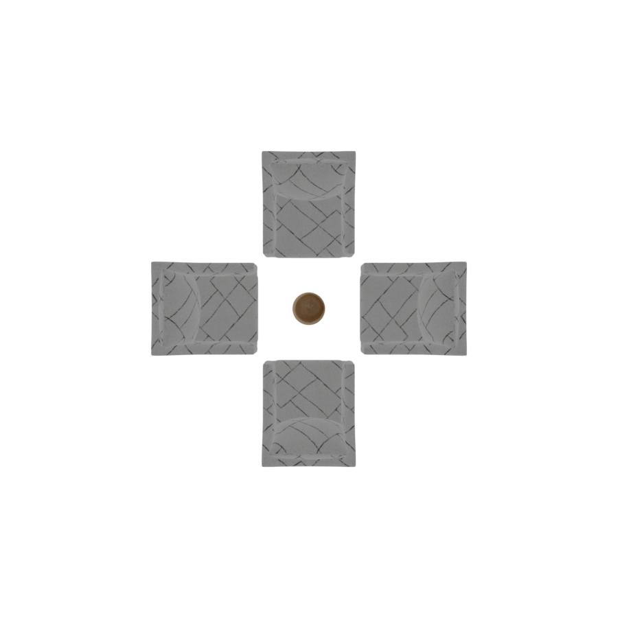
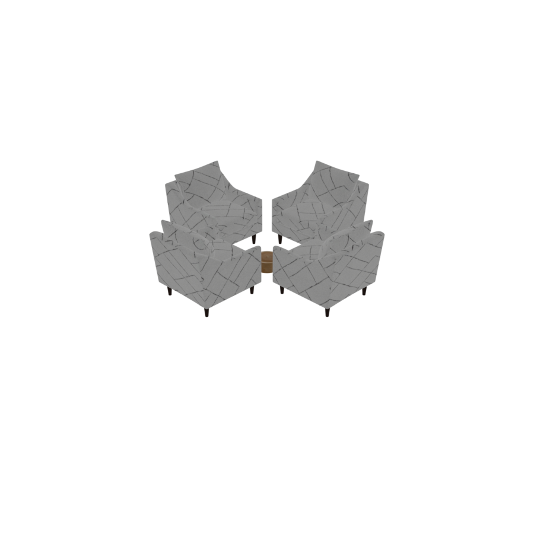
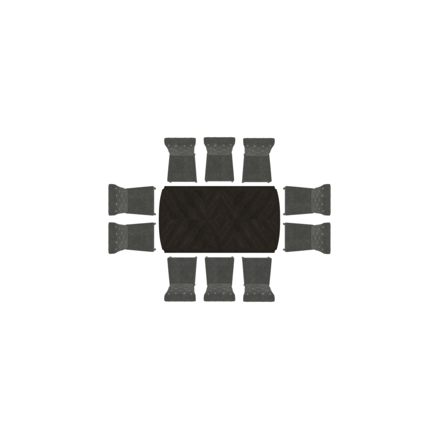
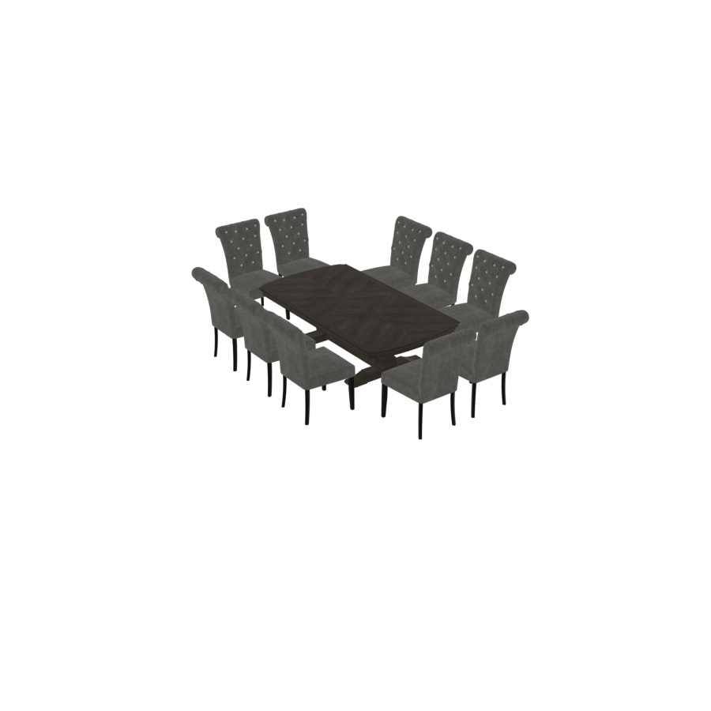
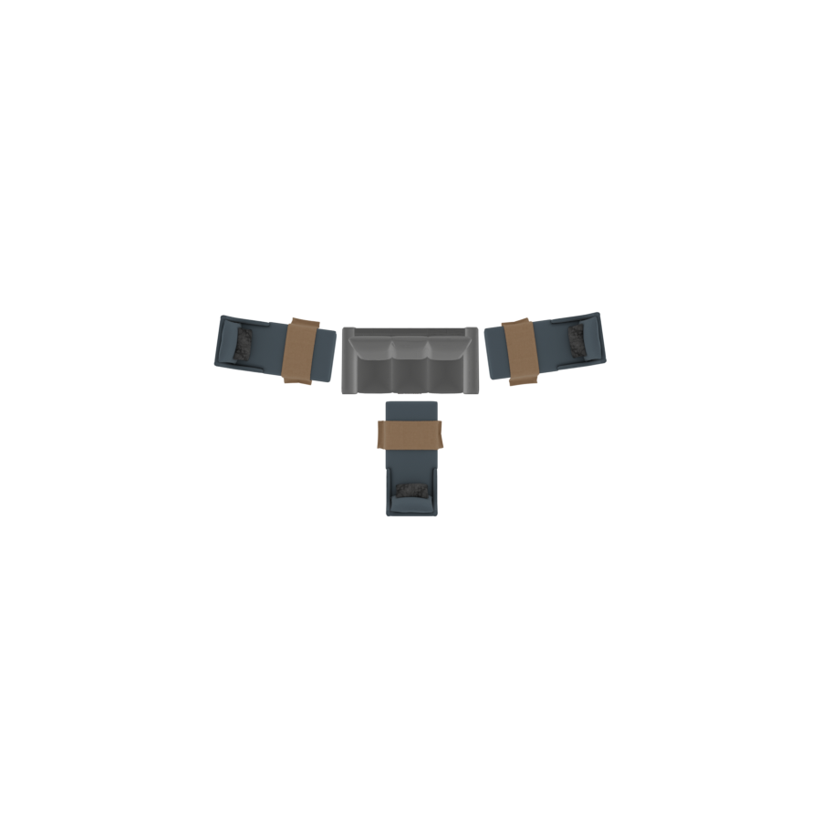
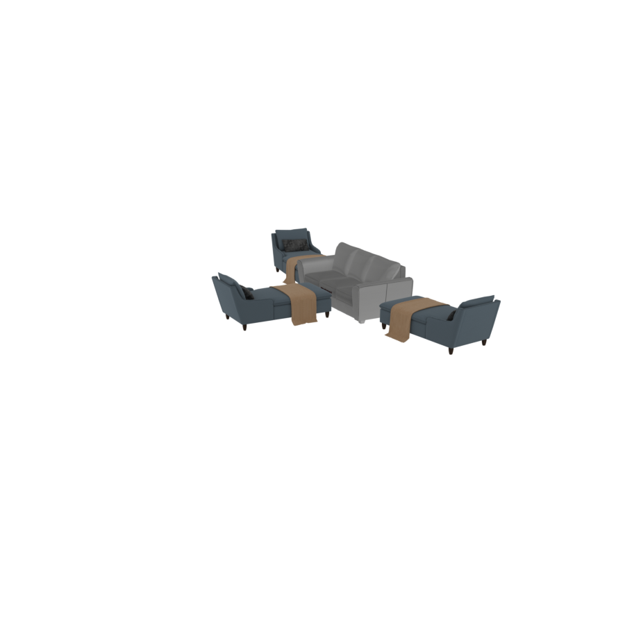
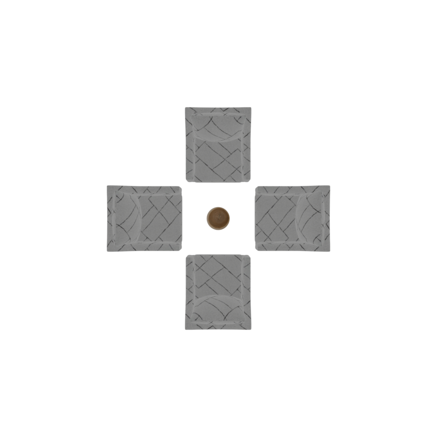
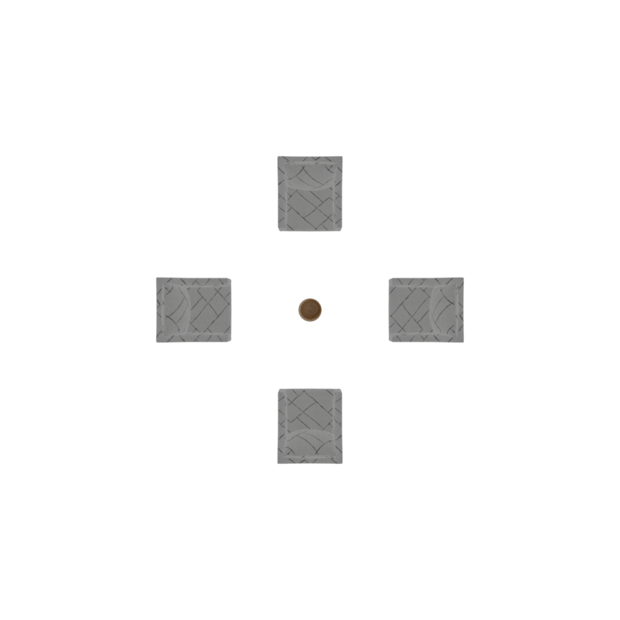

# AroundGroup

An `AroundGroup` arranges objects **around an anchor** — the classic case being chairs
around a table. It offers three layouts: a **rectilinear** ring (chairs along the sides of a
rectangular table), a full **circle**, and an **arc** (a fan of seats facing the anchor).

Like `RelativeGroup`, it is anchored: `set_anchor` chooses the central object, and the
surrounding objects are positioned relative to it and turned to **face** it.

```python
with scene.AroundGroup() as seating:
    table = scene.AddAsset("a round wooden coffee table")
    chair = scene.AddAsset("an upholstered accent chair")
    seating.set_anchor(table)
    seating.place_circle(objects=4 * chair)
```

## `place_circle(objects)`

Distributes the objects evenly around a full circle and turns each to face the anchor.

| Parameter | Type | Description |
|---|---|---|
| `objects` | list | The objects to arrange (commonly `n * chair`). |

<p style="text-align: center;">
  
  
</p>

If the objects can't all fit at the requested radius, the ring is pushed **outward** until
they do — the anchor keeps its natural size. The gap between the anchor and the ring is
controlled by `sparsity` (see below).

## `place_rectilinear(...)`

Places objects along the four sides of a rectangular anchor (e.g. a dining table). Each side
is an independent list, so you can seat a different number of chairs per edge.

| Parameter | Type | Description |
|---|---|---|
| `longer_side1`, `longer_side2` | list | Objects along the two long sides of the anchor. |
| `shorter_side1`, `shorter_side2` | list | Objects along the two short sides. |

```python
with scene.AroundGroup() as dining:
    table = scene.AddAsset("a large rectangular dining table with a dark wood finish")
    chair = scene.AddAsset("an elegant dining chair with a cushioned seat")
    dining.set_anchor(table)
    dining.place_rectilinear(
        longer_side1=3 * chair, longer_side2=3 * chair,
        shorter_side1=2 * chair, shorter_side2=2 * chair,
    )
```

<p style="text-align: center;">
  
  
</p>

If a side has more chairs than the table edge can hold, the table is widened (or deepened) so
they fit, and the chairs are spaced evenly along the resulting edge.

## `place_arc(objects, dist=0.1)`

Arranges objects in an arc on one side of the anchor, all facing it — a conversational
seating fan, or an audience facing a focal point.

| Parameter | Type | Default | Description |
|---|---|---|---|
| `objects` | list | *required* | Objects to arrange along the arc. |
| `dist` | `float` | `0.1` | Radial gap between the anchor and the arc, in metres. |

```python
with scene.AroundGroup(sparsity=0.5) as seating:
    sofa  = scene.AddAsset("a modern 3-seat sofa")
    chair = scene.AddAsset("a cozy lounge chair")
    seating.set_anchor(sofa)
    seating.place_arc(objects=3 * chair)
```

<p style="text-align: center;">
  
  
</p>

For an arc, `sparsity` controls the **spread angle**: at `0` the arc is as tight as the
objects allow; at `1` it fans out to a wide 150°.

## The `sparsity` parameter

`AroundGroup(sparsity=...)` takes a value in `[0, 1]` that controls how far the surrounding
objects sit from the anchor (for circle/rectilinear) or how wide they fan (for arc). `0` is
dense, `1` is spread out.

The two circles below are identical programs except for `sparsity` — `0.0` on the left,
`1.0` on the right:

<p style="text-align: center;">
  
  
</p>

```python
# dense
with scene.AroundGroup(sparsity=0.0) as seating:
    ...
# sparse
with scene.AroundGroup(sparsity=1.0) as seating:
    ...
```

## Compilation

`AroundGroup` compiles exactly like `RelativeGroup`: placements run, child groups compile
first, an `OverlapConstraint` and a VLM `ObjectProportionsConstraint` run, and the group
freezes into a single reusable unit ready to be placed in a room or another group.
