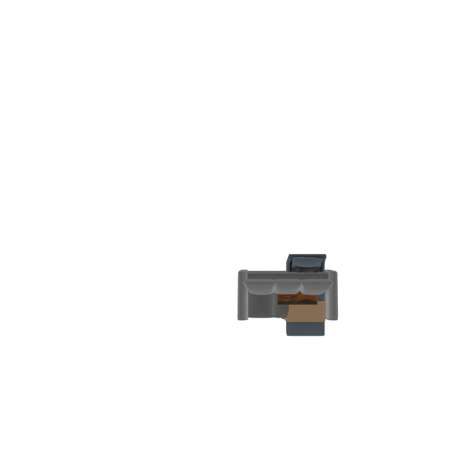
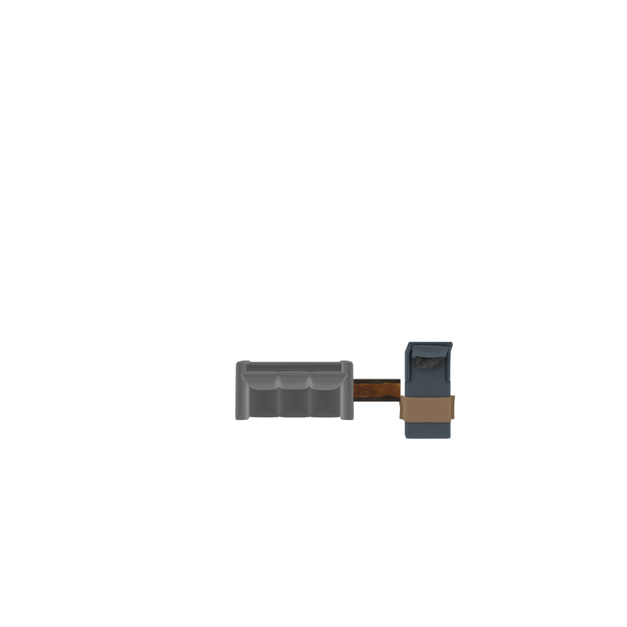
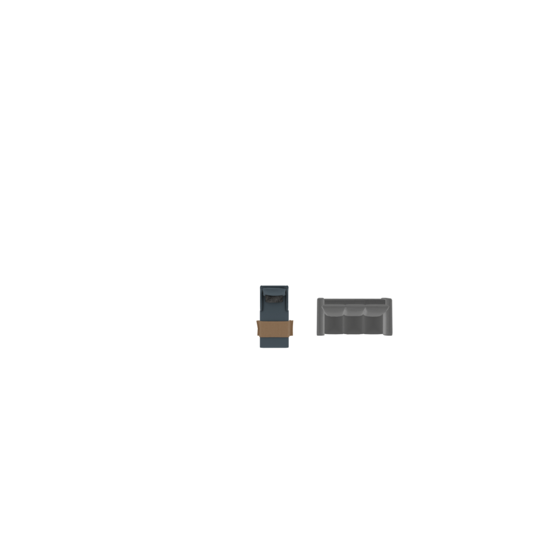
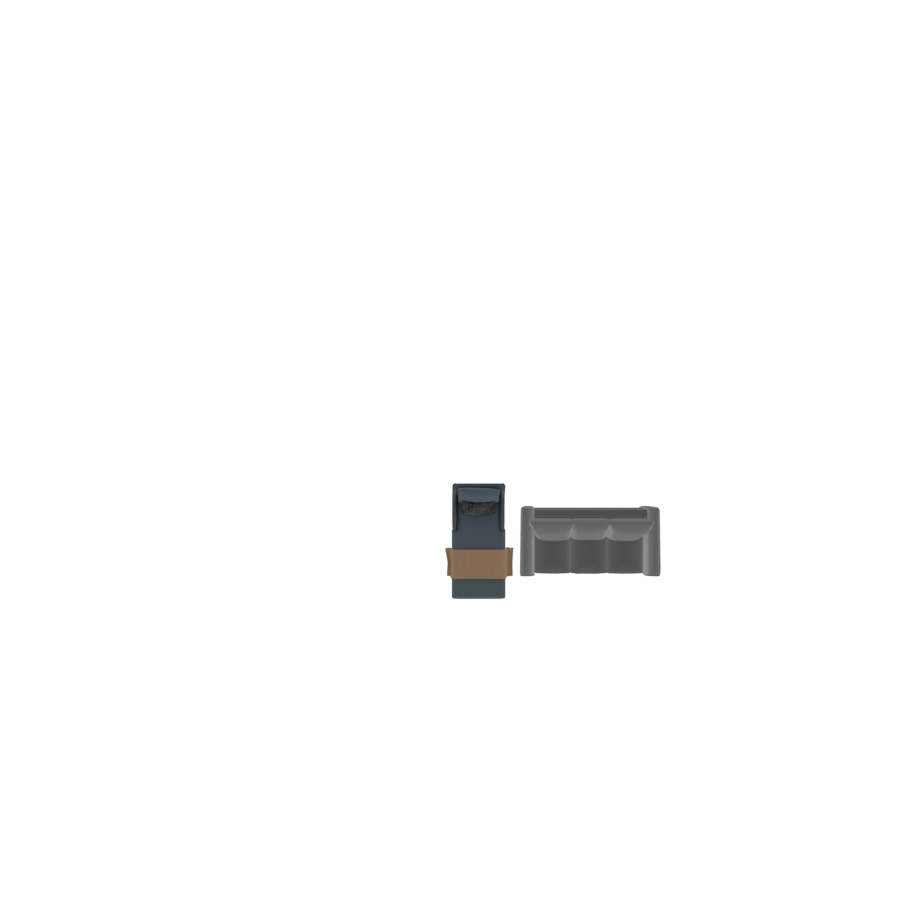
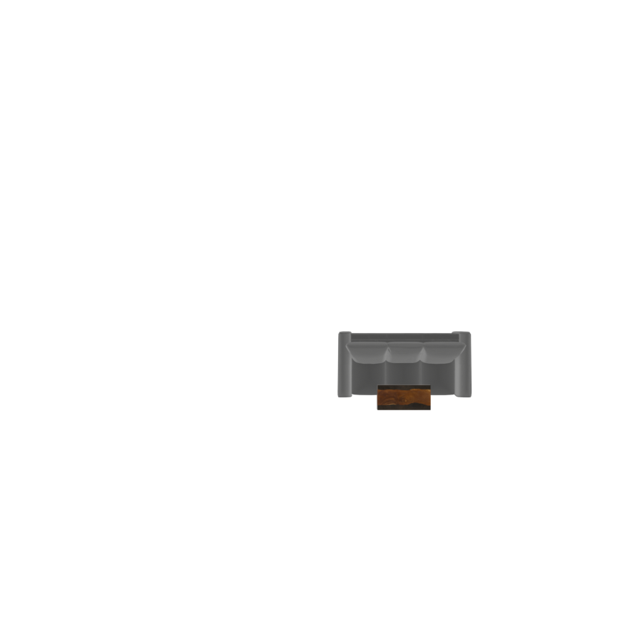
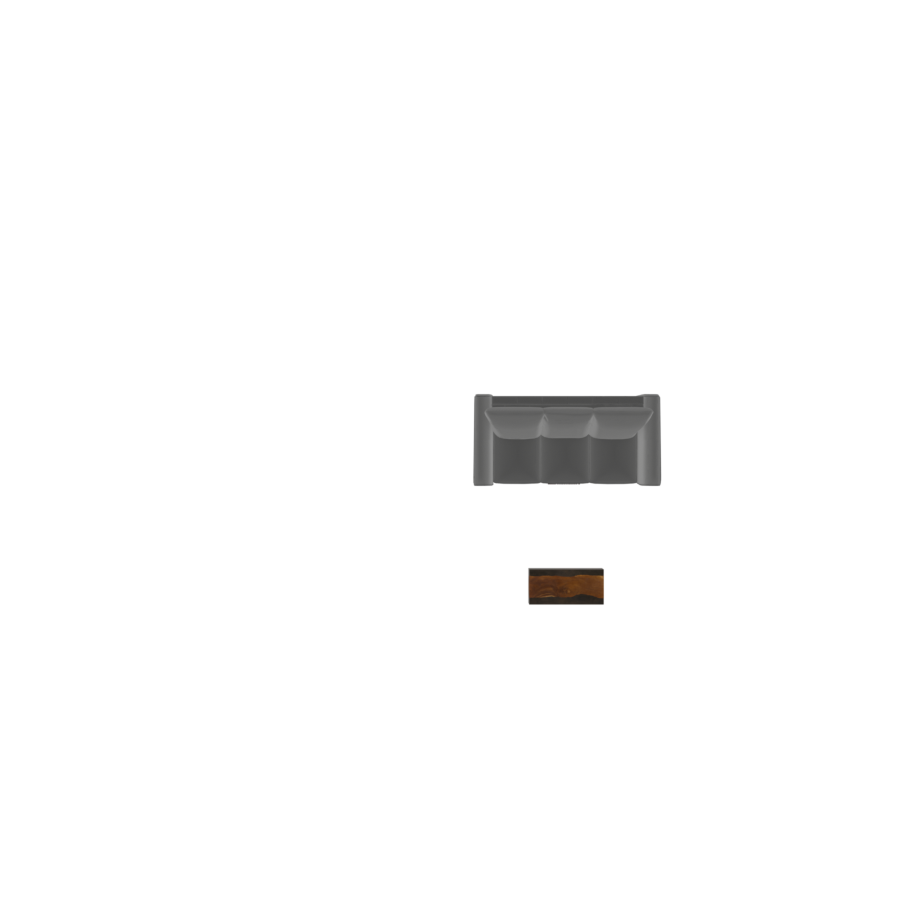
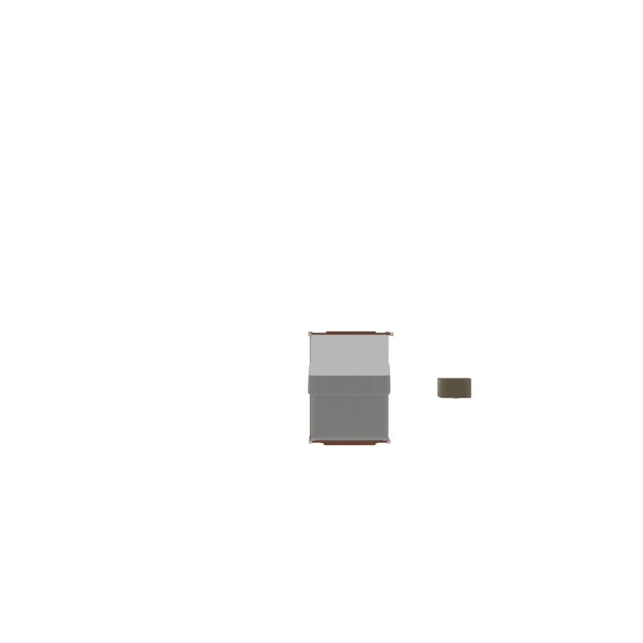
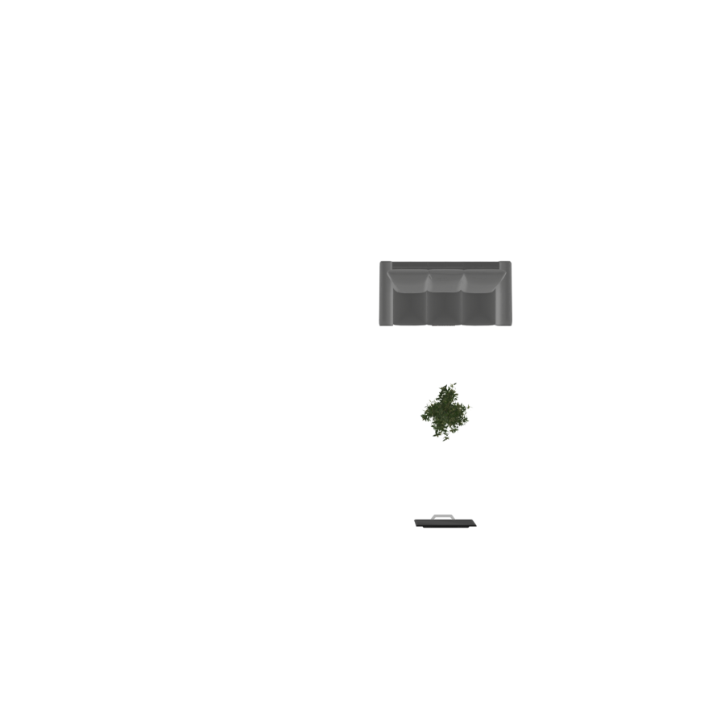
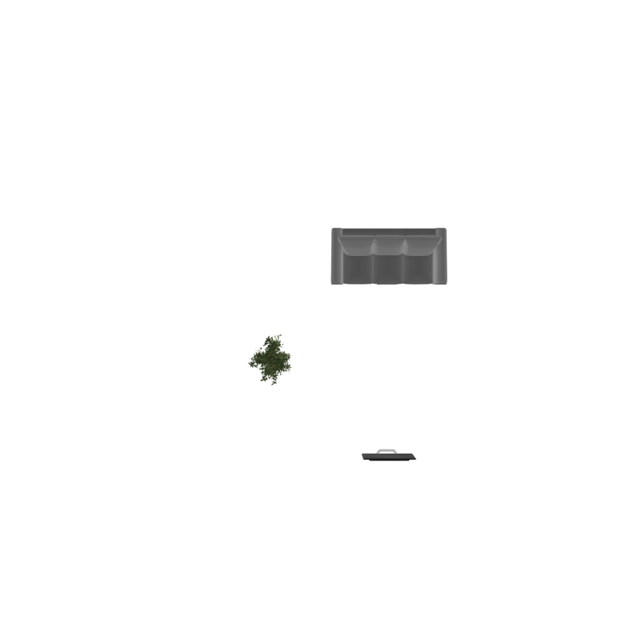

# Gradient Constraints

Gradient constraints are geometric rules enforced by an iterative solver. Each figure below
shows the layout **before** optimization (left) and **after** (right).

`OverlapConstraint` and `OutOfBoundsConstraint` run **automatically** during every room
compilation — you never add them yourself.

### Adding custom constraints

`ClearanceConstraint`, `AccessConstraint`, and `VisibilityConstraint` are *opt-in*. There is
an important subtlety: a group's `compile()` calls `clear_constraints()` at the start, so
constraints you register inside a normal `with` block are wiped before optimization runs. The
supported way to add them is to subclass a room and register the constraints **inside a
custom `compile()`**, after the automatic ones and before `grad_optimize()`:

```python
from IDSDL.groups import BasicRoomGroup

class ConstraintRoom(BasicRoomGroup):
    """A room that registers extra constraint hooks before optimizing."""
    def __init__(self, scene, WIDTH, DEPTH, HEIGHT, hooks=None, name=None):
        self._hooks = hooks or []
        super().__init__(scene, WIDTH=WIDTH, DEPTH=DEPTH, HEIGHT=HEIGHT, name=name)

    def compile(self):
        self.reset_compile_state()
        self.clear_constraints()
        for op in self.operations:
            op.execute()
        self.OverlapConstraint()        # automatic
        self.OutOfBoundsConstraint()    # automatic
        for hook in self._hooks:        # <- your custom constraints go here
            hook(self)
        self.grad_optimize()
        self.finalize_compile()
        self.is_frozen_group = True
        self.last_compile_report = self.make_compile_report()
        return self.last_compile_report

# usage: pass each constraint as a hook receiving the room
hooks = [lambda r: r.ClearanceConstraint(sofa, distance=0.8, dir="front")]
with ConstraintRoom(scene, WIDTH=5.0, DEPTH=5.0, HEIGHT=3.0, hooks=hooks) as room:
    room.place([sofa, table], positions=[(2.5, 0, 1.5), (2.5, 0, 2.0)], rotations=[0, 0])
```

The constraint calls below (`r.ClearanceConstraint(...)`, `r.AccessConstraint(...)`,
`r.VisibilityConstraint(...)`) are written as these hooks.

---

## OverlapConstraint

Ensures no two objects intersect. For each overlapping pair it pushes the objects apart
along the line between their centers, by an amount proportional to how deeply they overlap.

Objects flagged `ignore_overlap` (rugs, items placed on top of others, wall art) are
exempt.

```python
# runs automatically; nothing to call
with BasicRoomGroup(scene, WIDTH=6.0, DEPTH=5.0, HEIGHT=3.0) as room:
    room.place([sofa, table, chair],
               positions=[(2.3, 0, 2.5), (2.5, 0, 2.5), (2.7, 0, 2.5)],  # stacked
               rotations=[0, 0, 0])
```

<p style="text-align: center;">
  
  
</p>

Three objects stacked at nearly the same point (left) are separated into a clean,
non-overlapping row (right).

---

## OutOfBoundsConstraint

Pulls any object whose bounding box crosses a room wall back inside. The room must define
`WIDTH` and `DEPTH` (every `RoomGroup` does). A small deterministic clamp at the end of
optimization guarantees nothing ends up outside, even in tightly packed scenes.

<p style="text-align: center;">
  
  
</p>

The sofa starts pushed off the right edge of a 5 m-wide room (left) and is pulled fully
inside (right).

---

## ClearanceConstraint

Reserves a minimum amount of free space around an object — circulation space in front of a
sofa, room to open a wardrobe, etc.

```python
hooks = [lambda r: r.ClearanceConstraint(obj, distance=0.8, dir="front")]
```

| Parameter | Type | Default | Description |
|---|---|---|---|
| `obj` | object | *required* | The object to keep clear. |
| `distance` | `float` | `0.5` | Minimum free space to maintain, in metres. |
| `dir` | `str` | `"front"` | Where to enforce clearance: `"front"`, `"sides"`, or `"all"`. |
| `omit_objs` | list | `None` | Objects to ignore when measuring clearance. |

- **`"front"`** — clear space only in front of the object's facing direction.
- **`"sides"`** — clear space to the left and right.
- **`"all"`** — clear space on all four sides.

<p style="text-align: center;">
  
  
</p>

A coffee table crowding the front of the sofa (left) is pushed forward until the requested
0.8 m gap opens up (right).

---

## AccessConstraint

The complement of clearance: it keeps a target object within a **reachable distance band** of
another — a nightstand beside a bed, a chair tucked to a desk. If the target drifts too far
it is pulled back; if it is too close it is nudged out, so the gap stays in `[min_dist,
max_dist]`.

```python
hooks = [lambda r: r.AccessConstraint(bed, nightstand, min_dist=0.05, max_dist=0.25, dir="sides")]
```

| Parameter | Type | Default | Description |
|---|---|---|---|
| `obj` | object | *required* | The reference object (e.g. the bed). |
| `target` | object | *required* | The object kept within reach (e.g. the nightstand). |
| `min_dist` | `float` | `0.1` | Closest allowed gap, in metres. |
| `max_dist` | `float` | `0.15` | Farthest allowed gap, in metres. |
| `dir` | `str` | `"front"` | Which side to measure: `"front"` or `"sides"`. |

<p style="text-align: center;">
  
  
</p>

A nightstand drifting far from the bed (left) is pulled back to sit within reach of its side
(right).

---

## VisibilityConstraint

Keeps the sightline between a **source** and a **target** clear — for example, between a sofa
and a TV. Any object intruding into the viewing corridor is pushed sideways out of it.

```python
hooks = [lambda r: r.VisibilityConstraint(sofa, tv)]
```

| Parameter | Type | Description |
|---|---|---|
| `source` | object | One end of the sightline (e.g. the viewer's seat). |
| `target` | object | The other end (e.g. the screen). |

<p style="text-align: center;">
  
  
</p>

A plant sitting directly between the sofa and the TV (left) is moved aside, clearing the
sightline (right).
