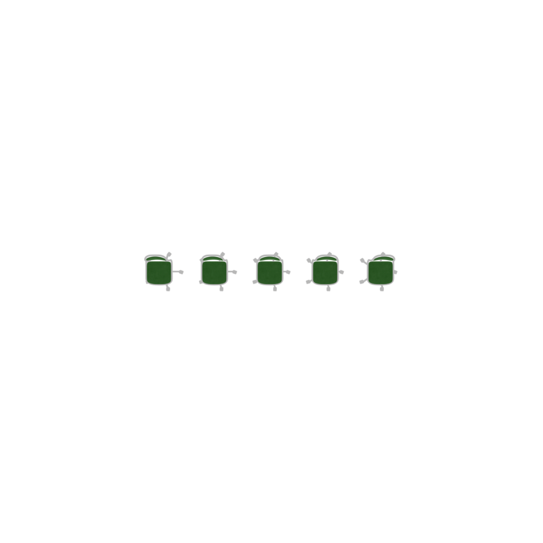
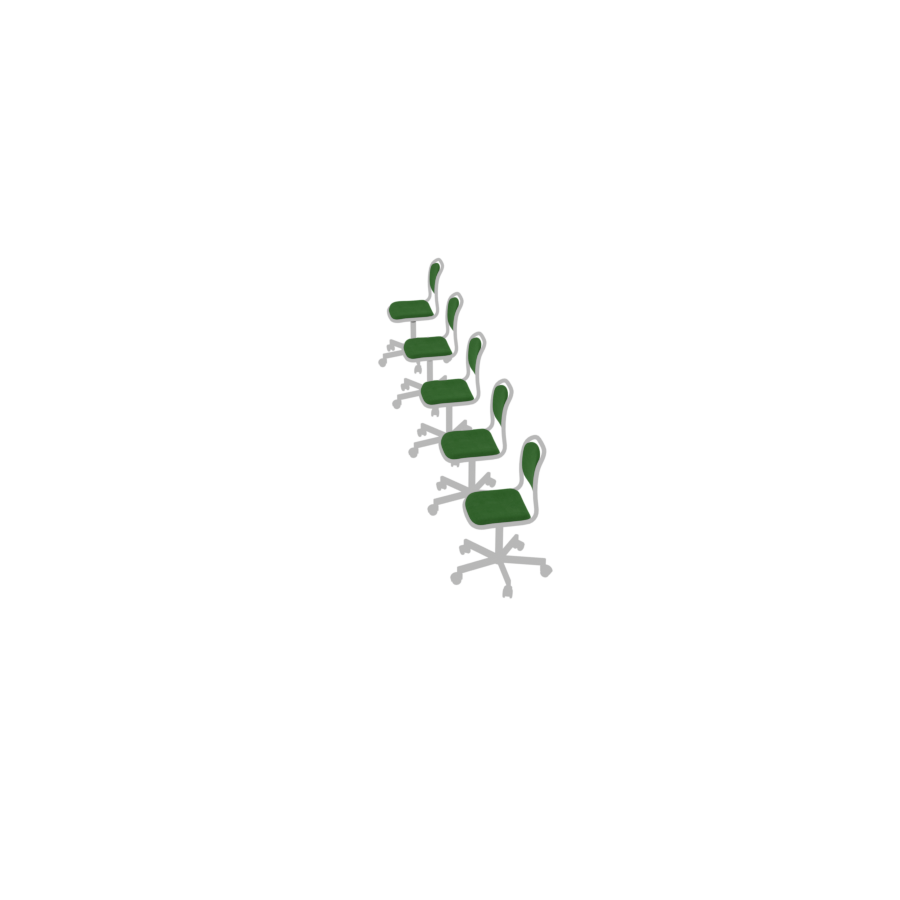
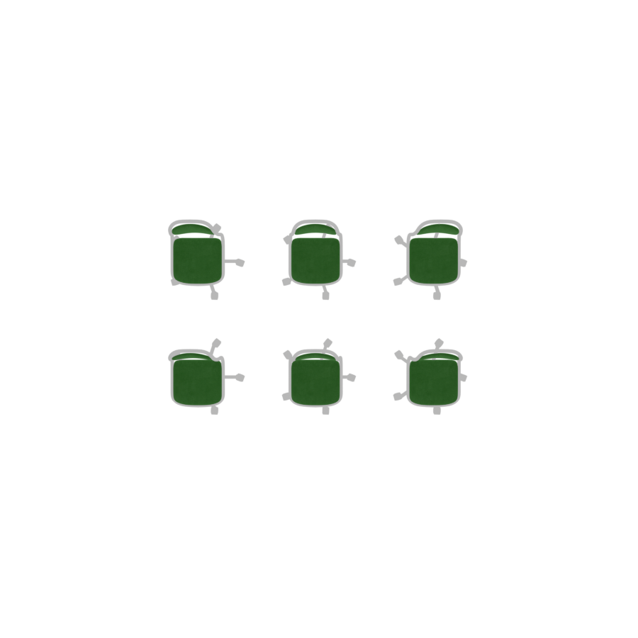
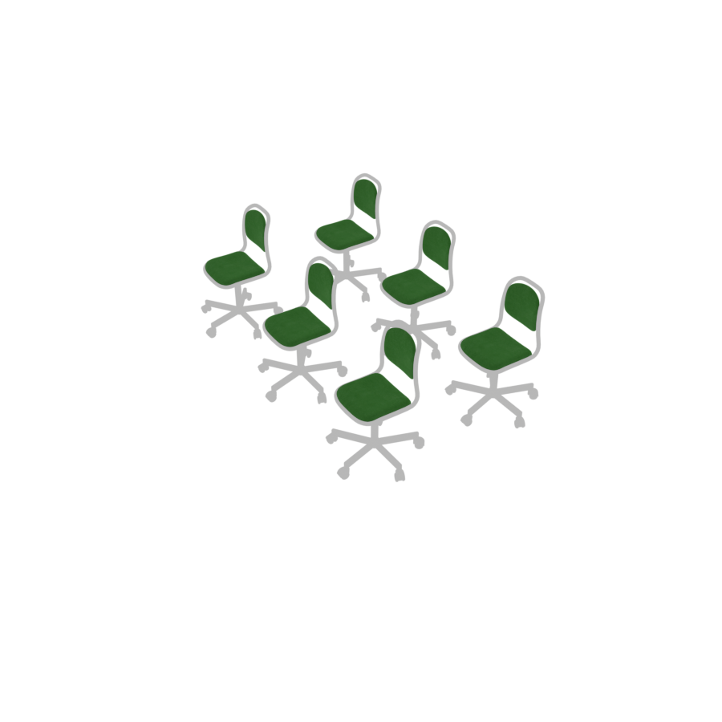
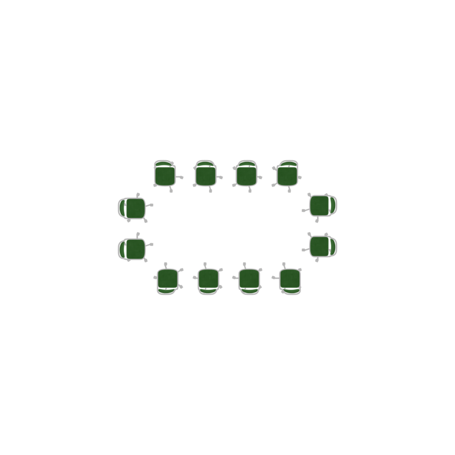
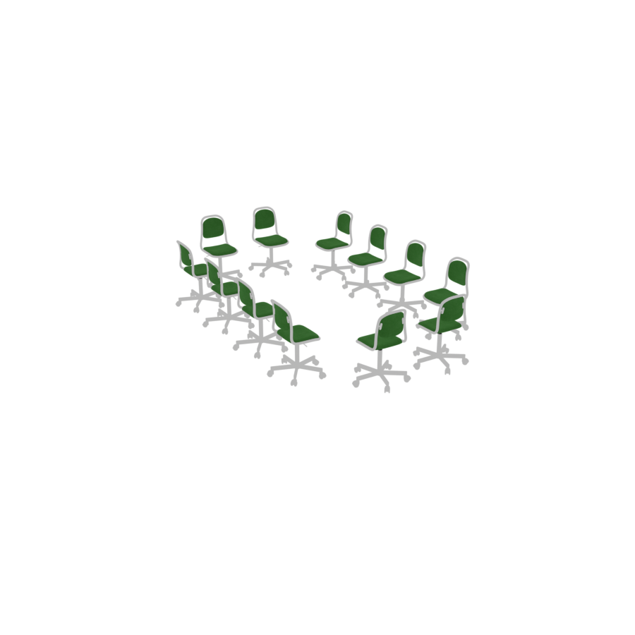
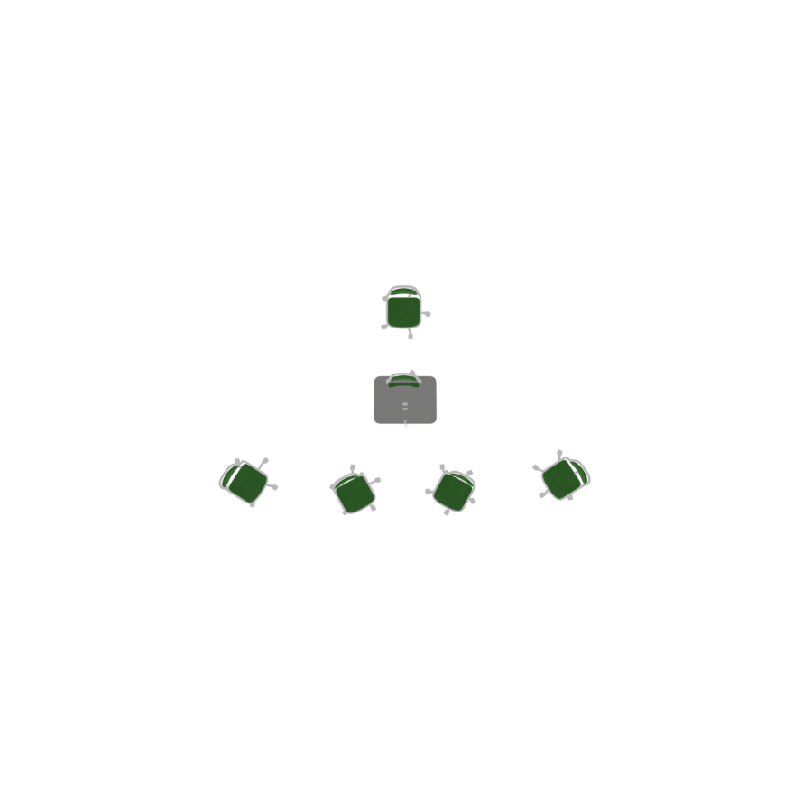
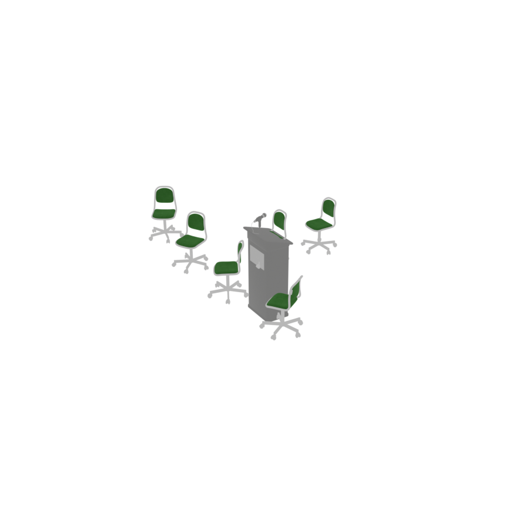
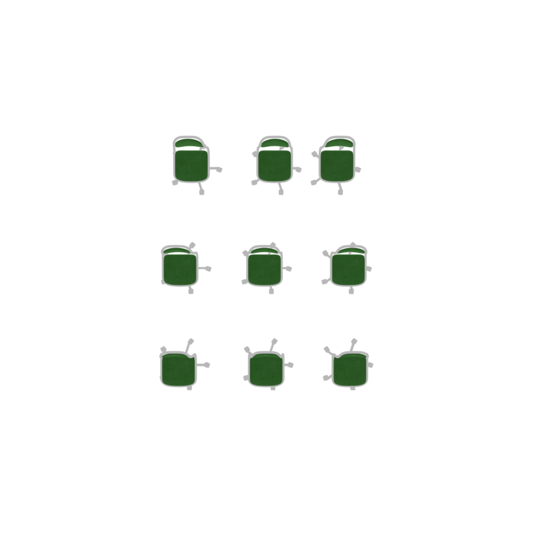
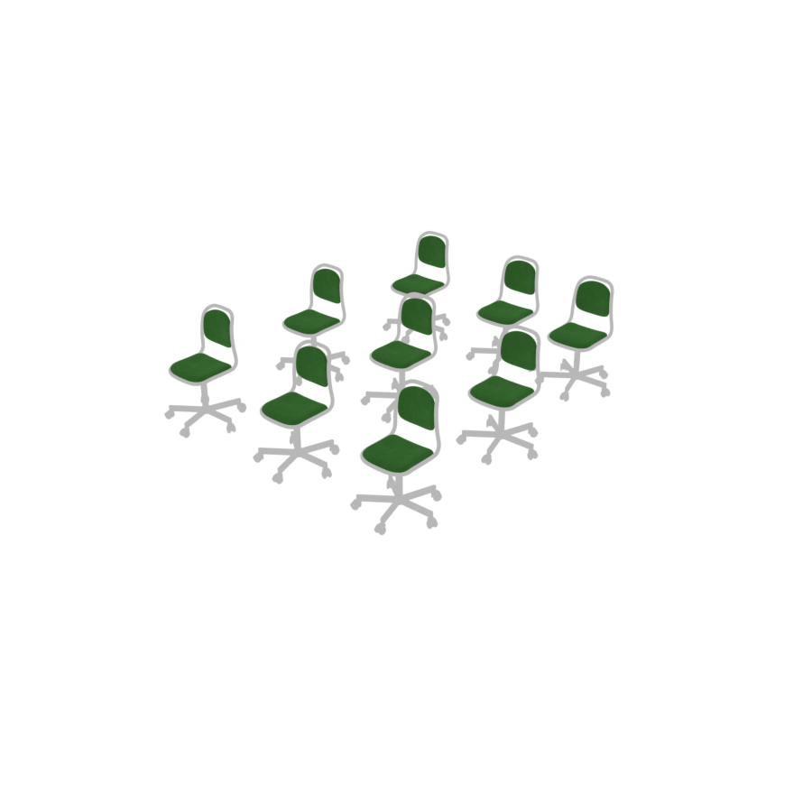

# GridGroup

A `GridGroup` arranges objects in **regular patterns** — rows, 2D grids, rectangular
borders, and curved arcs. It is *anchorless*: there is no central object, just a pattern laid
out around the group's own center. This is the tool for repeated furniture: classroom desks,
auditorium seating, a row of lockers.

```python
with scene.GridGroup(sparsity=0.5) as classroom:
    chair = scene.AddAsset("a standard classroom chair with a plastic seat")
    classroom.place_grid(6 * chair, cols=3)
```

Unlike the anchored groups, a `GridGroup` is **deterministic**: its layout is fully
determined by the pattern, so compilation skips overlap and proportion optimization entirely.

## `place_row(objects)`

Lays objects out in a single row along the X axis, evenly spaced.

<p style="text-align: center;">
  
  
</p>

## `place_grid(objects, cols)`

Fills a 2D grid row-major: objects are placed left-to-right, wrapping to a new row every
`cols` objects.

| Parameter | Type | Description |
|---|---|---|
| `objects` | list | Objects to arrange. |
| `cols` | `int` | Number of columns; rows are added as needed. |

<p style="text-align: center;">
  
  
</p>

## `place_rectilinear(width1, width2, depth1, depth2)`

Arranges objects along the four sides of a rectangular border, leaving the middle open — a
ring of seats around a meeting space, or chairs lining the walls.

| Parameter | Type | Description |
|---|---|---|
| `width1` | list | Top row (runs along X). |
| `width2` | list | Bottom row (runs along X). |
| `depth1` | list | Left column (runs along Z). |
| `depth2` | list | Right column (runs along Z). |

<p style="text-align: center;">
  
  
</p>

## `place_arc(objects, towards=None)`

Lays objects out in one or more curved rows, like theatre seating. With `towards` set, every
object turns to face that target (a stage, lectern, or screen); otherwise objects face along
the arc.

| Parameter | Type | Default | Description |
|---|---|---|---|
| `objects` | list | *required* | Objects to arrange. |
| `towards` | object | `None` | If set, each object faces this target. |

```python
lectern = scene.AddAsset("a wooden lectern or podium")
with scene.GridGroup(sparsity=0.4) as audience:
    chair = scene.AddAsset("a standard classroom chair with a plastic seat")
    audience.place_arc(6 * chair, towards=lectern)
```

<p style="text-align: center;">
  
  
</p>

The number of rows is chosen automatically: as the arc fills up, additional rows are added
further back. `sparsity` widens both the arc angle and the gap between rows.

## Parameters: `sparsity` and `randomness`

`GridGroup(sparsity=..., randomness=...)` accepts two layout controls, both in `[0, 1]`.

- **`sparsity`** — the gap between objects, as a fraction of their size. `0` packs them
  edge-to-edge; higher values open up space between them.
- **`randomness`** — jitters the spacing so the arrangement looks organic instead of
  mechanical. `0` gives perfectly uniform gaps; higher values introduce controlled variation.

The grid below uses `randomness=0.9`, giving visibly irregular spacing compared to the clean
grid above:

<p style="text-align: center;">
  
  
</p>

```python
with scene.GridGroup(sparsity=0.5, randomness=0.9) as g:
    chair = scene.AddAsset("a standard classroom chair with a plastic seat")
    g.place_grid(9 * chair, cols=3)
```
