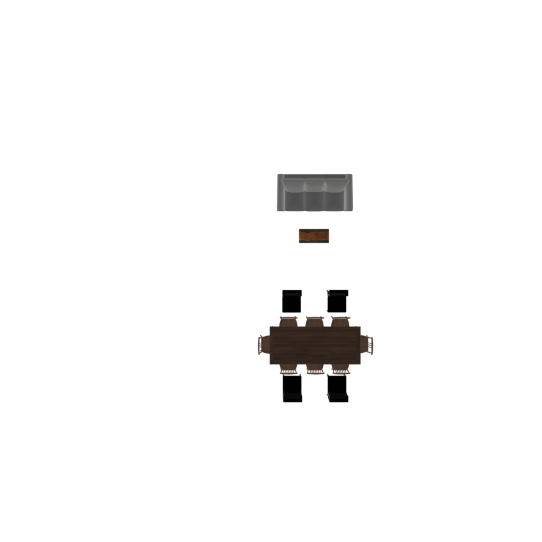
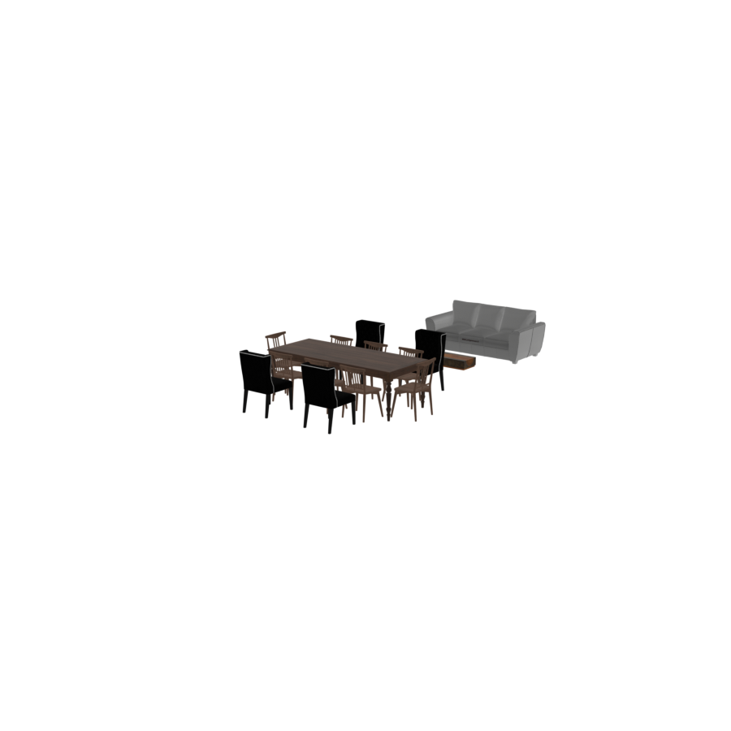

# Hierarchical Layout & Parent–Child Relationships

Real interiors are hierarchical. A *living area* contains a *seating cluster* (sofa + coffee
table + side chairs) and a *media unit* (TV + stand). A *bedroom* contains a *bed cluster*
(bed + nightstands + lamps) and a *wardrobe*. IDSDL mirrors this directly: **groups nest
inside other groups**, and the language optimizes each level independently.

## The scene tree

Every object and group is a node in a tree. Groups become parents of the objects (and
sub-groups) placed inside them:

- `set_anchor(obj)` and every `place_*` call attach the argument as a **child** of the group.
- `group.get_children()` returns all leaf objects beneath a group, flattened.
- `group.children` returns the *direct* children only (which may themselves be groups).
- `group.get_aabb()` returns the union bounding box of the entire subtree.

So a group is simultaneously a container (it has children) and an object (it has a location,
rotation, and bounding box). That duality is what lets you treat a finished cluster as a
single placeable item.

## Freezing: a compiled group is one rigid unit

When a group's `with` block closes, it **compiles** and then **freezes** (`is_frozen_group =
True`). A frozen group:

- has a fixed internal layout (its members won't move relative to each other),
- exposes a single bounding box spanning all its members,
- can be translated, rotated, and placed exactly like a single asset.

This is why you can write:

```python
# build a seating cluster — it freezes when the block closes
with scene.RelativeGroup() as seating:
    sofa  = scene.AddAsset("a modern 3-seat sofa")
    table = scene.AddAsset("a rectangular wooden coffee table")
    seating.set_anchor(sofa)
    seating.place_on_front(table)

# now hand the whole cluster to the room as if it were one object
with scene.RoomGroup() as room:
    room.place_on_back_wall_center(seating, facing="front")
```

## Bottom-up compilation

Groups compile **inside-out**. When the outer group compiles, it first compiles any child
groups, so by the time the outer level runs its optimization, every inner group is already a
finished, frozen unit. Concretely, for the room above:

1. `seating` compiles first (its `with` block closes first): sofa + table are laid out,
   overlap/proportions are resolved, and the cluster freezes.
2. `room` then compiles: it sees `seating` as a **single rigid block** with one bounding box.

## Hierarchical optimization

This is the key consequence: **the room optimizes groups, not loose objects.** When the
room's overlap and out-of-bounds solver runs, it moves each frozen sub-group as a whole —
the sofa and its coffee table travel together and never separate. The solver uses the
group's union bounding box for collision and boundary tests, so an entire seating cluster is
kept clear of an entire dining cluster, without the solver ever needing to reason about the
individual chairs inside them.

The scene below places two independent clusters in one room — a sofa + coffee-table
`RelativeGroup` against the back wall and a `AroundGroup` dining set against the front wall.
Each was optimized internally first, then positioned as a unit at the room level:

```python
with scene.AroundGroup() as dining:
    table = scene.AddAsset("a large rectangular dining table")
    chair = scene.AddAsset("an elegant dining chair")
    dining.set_anchor(table)
    dining.place_rectilinear(longer_side1=2 * chair, longer_side2=2 * chair)

with scene.RelativeGroup() as seating:
    sofa   = scene.AddAsset("a modern 3-seat sofa")
    coffee = scene.AddAsset("a rectangular wooden coffee table")
    seating.set_anchor(sofa)
    seating.place_on_front(coffee)

with scene.RoomGroup() as room:
    room.place_on_back_wall_center(seating, facing="front")
    room.place_on_front_wall_center(dining, facing="back")
```

<p style="text-align: center;">
  
  
</p>

## Why placement is deferred

Inside a group's `with` block, the `place_*` calls do not run immediately — they are
**recorded** and replayed during compilation. This deferral is what enables hierarchical
optimization to work correctly:

- A group can't know its final size until *all* its placements are declared, and it can't be
  positioned by its parent until it knows its size. Recording-then-replaying lets the group
  gather every placement first, compute its true bounding box, and only then freeze.
- It also lets the language choose a sensible **execution order** — for example, running
  `place_on_top` and `place_rug` *after* the main furniture is positioned, so a lamp lands on
  a nightstand's final location and a rug spans the cluster's final footprint.

You don't manage any of this yourself; it happens when the `with` block closes. The mental
model is simply: *declare intent inside the block, get a finished, frozen unit out.*

## Reusing a cluster

Because a frozen group is a self-contained unit, you can duplicate it with the `*` operator
just like a single asset — handy for symmetric layouts such as identical nightstands on both
sides of a bed:

```python
with scene.RelativeGroup() as nightstand_area:
    nightstand = scene.AddAsset("a small wooden nightstand with a drawer")
    lamp       = scene.AddAsset("a modern table lamp with a white shade")
    nightstand_area.set_anchor(nightstand)
    nightstand_area.place_on_top(lamp)

with scene.RelativeGroup() as bed_area:
    bed = scene.AddAsset("a queen-sized bed with a wooden frame")
    bed_area.set_anchor(bed)
    bed_area.place_on_back_left(nightstand_area)
    bed_area.place_on_back_right(1 * nightstand_area)   # a fresh copy of the cluster
```
