# Motif Groups

Six additional placement groups for common arrangement *motifs*. Each is used exactly like the
core groups (`with scene.…Group() as g:`), composes/nests into a `RoomGroup`, and is shown below
with its code and rendered top-down + perspective views.

---

## StackGroup

Stack objects vertically, each resting on the one below.

```python
with scene.StackGroup() as stack:
    crate = scene.AddAsset("a wooden storage crate")
    stack.place_stack(3 * crate)
```

<p style="text-align: center;">
  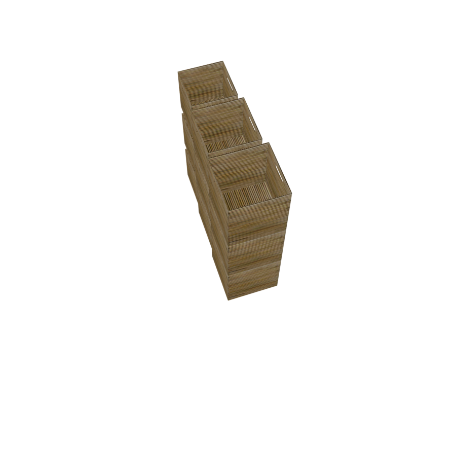
  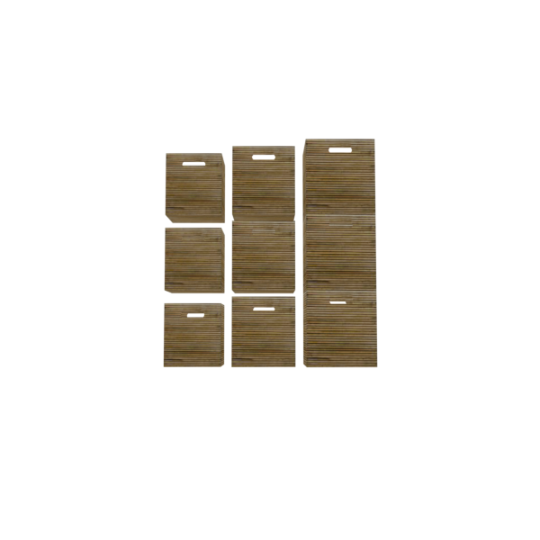
</p>

*(A vertical stack is shown in perspective and front views — top-down is not a useful angle for it.)*

---

## PyramidGroup

Centered tiers of decreasing count, stacked upward.

```python
with scene.PyramidGroup() as pyr:
    crate = scene.AddAsset("a wooden storage crate")
    pyr.place_pyramid(6 * crate)
```

<p style="text-align: center;">
  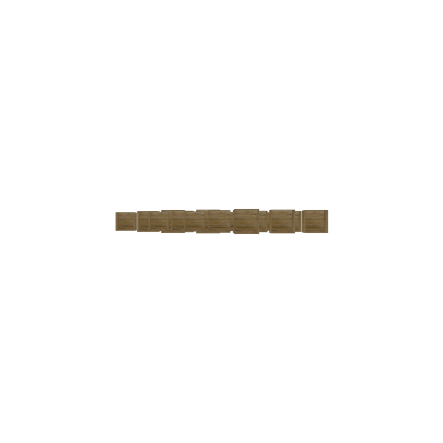
  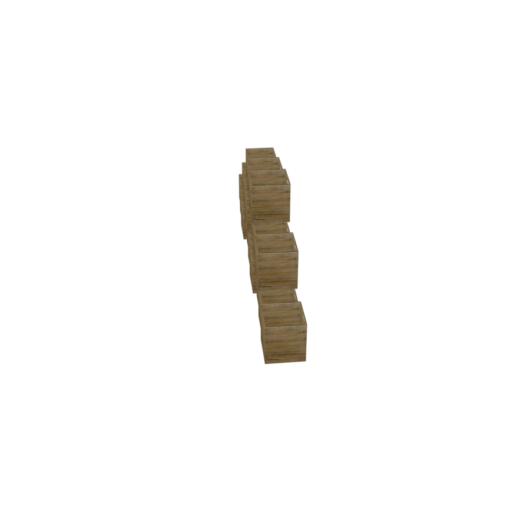
</p>

---

## PileGroup

Scatter objects organically within a region; the inherited overlap solver then relaxes them apart.

```python
with scene.PileGroup() as pile:
    cushion = scene.AddAsset("a square floor cushion")
    pile.place_pile(7 * cushion, spread=0.8)
```

<p style="text-align: center;">
  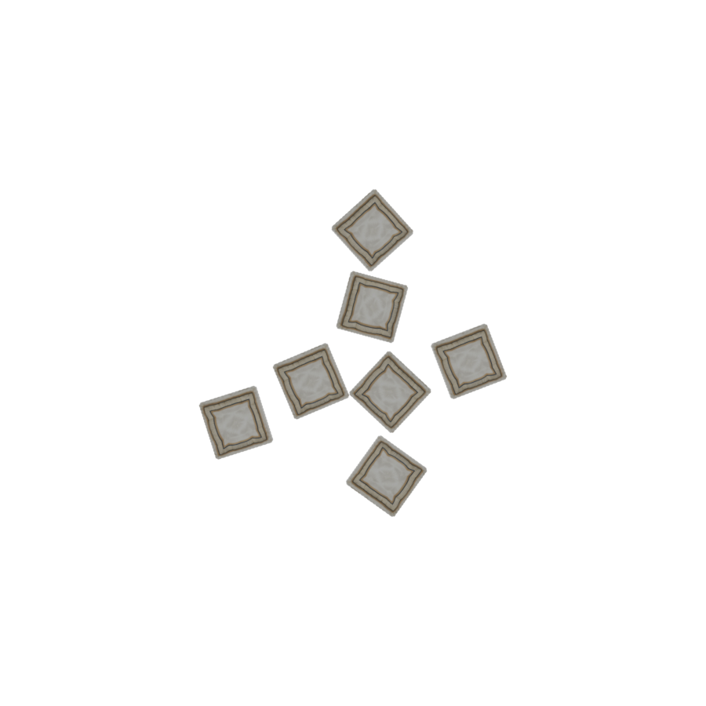
  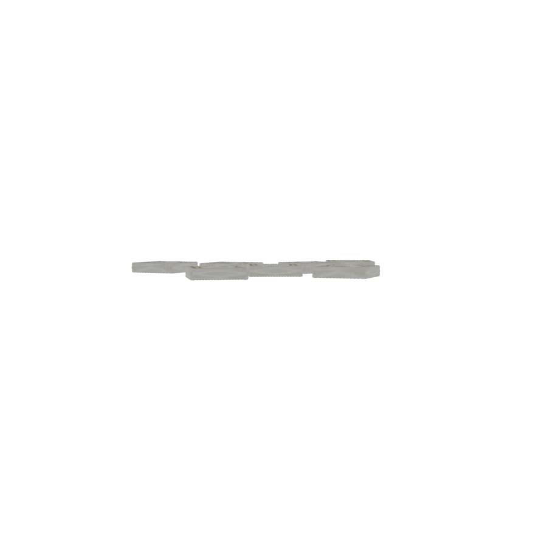
</p>

---

## SymmetryGroup

Flank an anchor with mirror-symmetric pairs (each given object is auto-copied to the opposite side).

```python
with scene.SymmetryGroup() as sym:
    bed = scene.AddAsset("a queen-sized bed with a wooden frame")
    sym.set_anchor(bed)
    nightstand = scene.AddAsset("a small wooden nightstand with a drawer")
    sym.place_flanking(nightstand)
```

<p style="text-align: center;">
  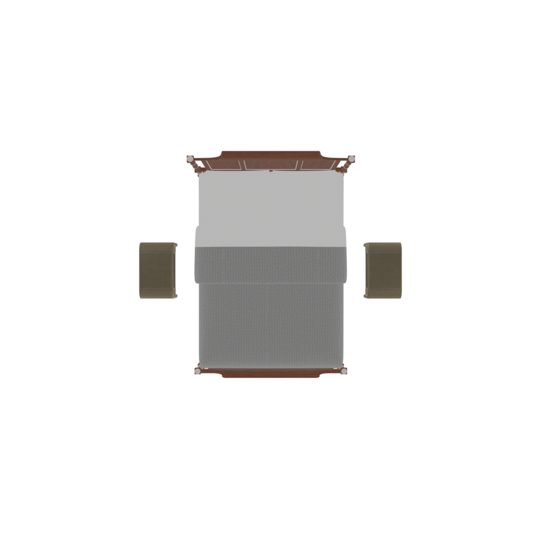
  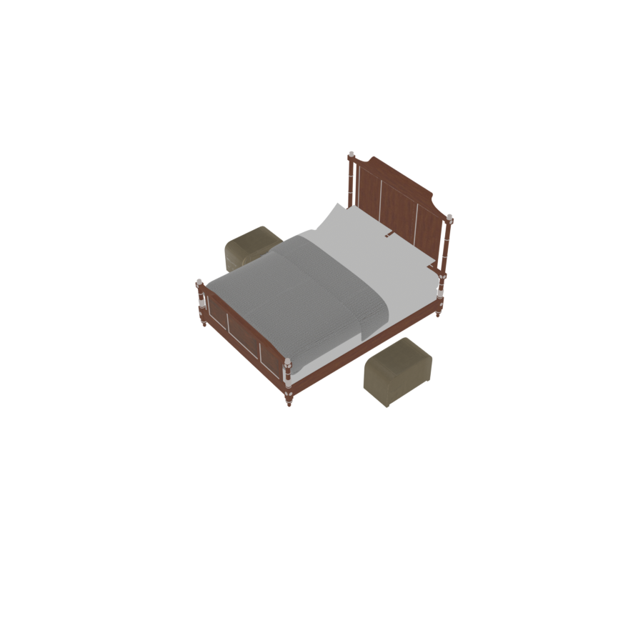
</p>

---

## FacingGroup

Two parallel rows on opposite sides of an anchor, each turned to face it.

```python
with scene.FacingGroup() as g:
    table = scene.AddAsset("a rectangular wooden coffee table")
    g.set_anchor(table)
    chair = scene.AddAsset("a cozy lounge chair")
    g.place_facing_rows(2 * chair, 2 * chair)
```

<p style="text-align: center;">
  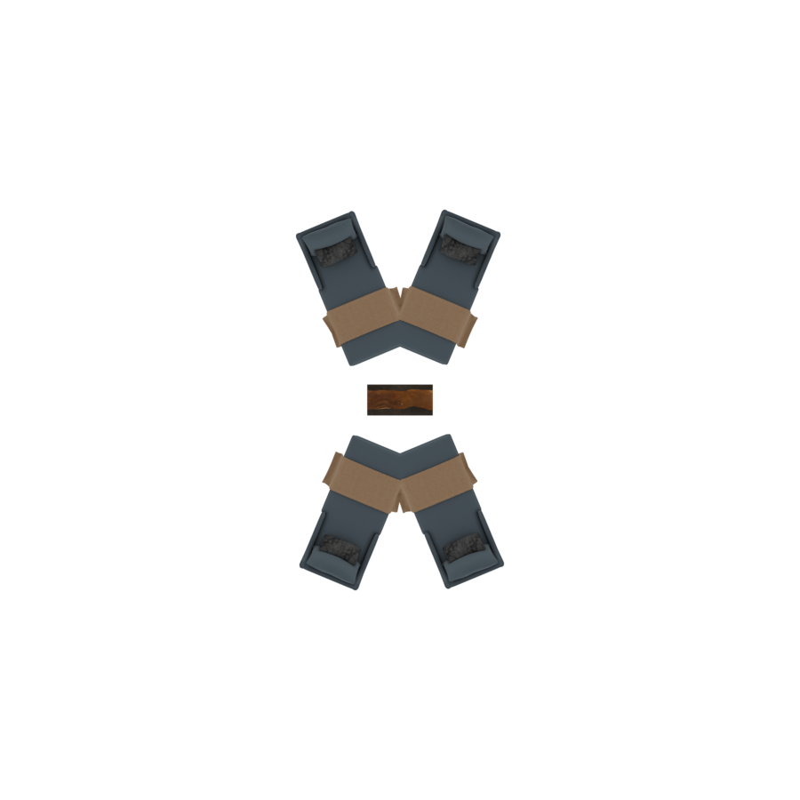
  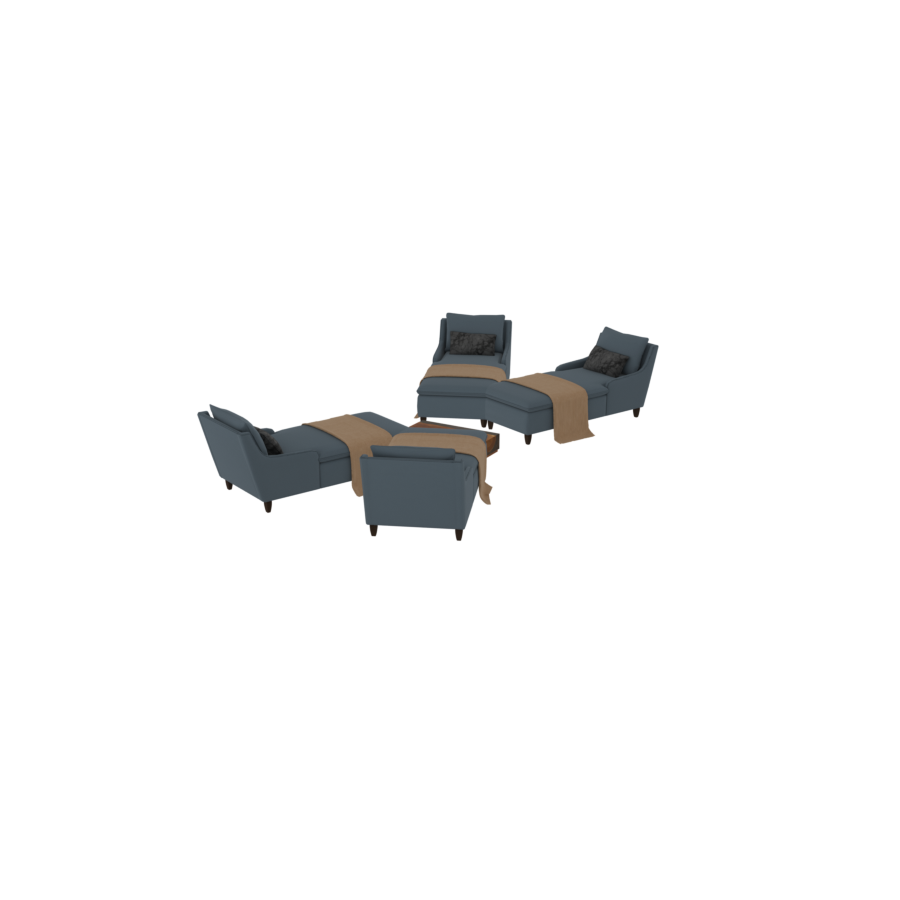
</p>

---

## RingsGroup

Concentric rings of objects around an anchor (inner ring first), each facing inward. Subclasses
`AroundGroup`, so it shares the `sparsity` parameter.

```python
with scene.RingsGroup(sparsity=0.3) as g:
    table = scene.AddAsset("a large round dining table with a dark wood finish")
    g.set_anchor(table)
    chair = scene.AddAsset("an upholstered accent chair")
    g.place_rings([4 * chair, 8 * chair])   # inner ring of 4, outer ring of 8
```

<p style="text-align: center;">
  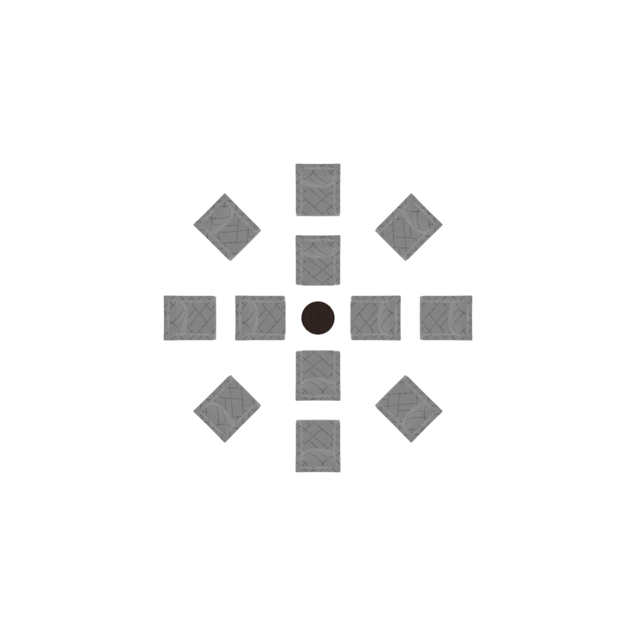
  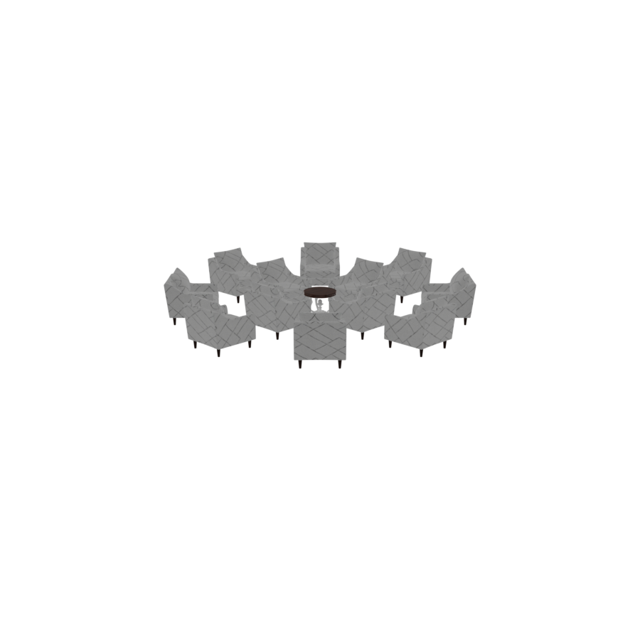
</p>
