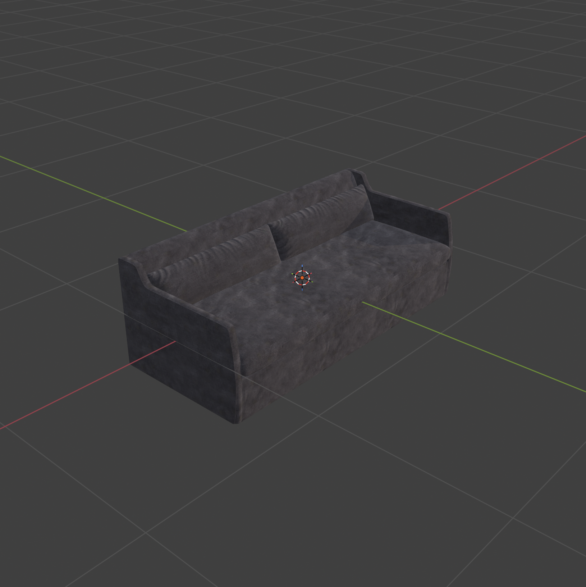
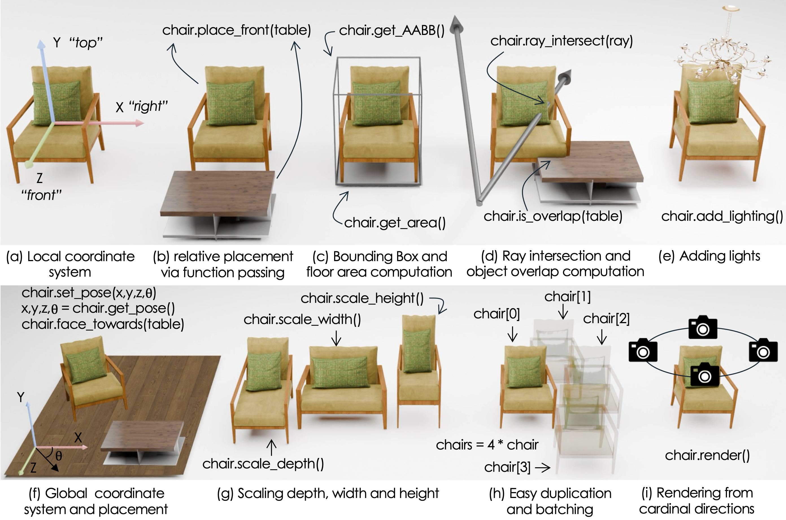

# Object Registration


The very first thing we need in our scenes is objects. IDSDL provides an intuitive natural language interface for adding objects to a scene. Let’s start by adding a simple couch.

But first, we need to initialize the scene.

```
from IDSDL.scene import SceneProgRoom
scene = SceneProgRoom("test_room")
```

Next, add the sofa. 

```
sofa = scene.AddAsset("a modern gray sofa")
```

However, assets must be registered within the scene before they appear when the scene is compiled and exported.

```
scene.bind(sofa)
scene.export("test-scene.blend")
```

<p style="text-align: center;">
  
</p>

Using IDSDL, objects can be retrieved from a variety of datasets by providing custom retrieval logic. Consider the following example, which was used to build a cherry blossom forest.

```
class CherryBlossomRetriever(SceneProgAssetRetrieverBase):
    def __init__(self):
        super().__init__()
        self.name = "CherryBlossomRetriever"
        self.description = f"""
Retrieves cherry blossom tree
"""
        self.examples = """
1. A cherry blossom tree in full bloom
"""
        self.path = os.path.join(os.path.dirname(__file__), "assets/cherry_blossom.glb")

    def __call__(self, query: str) -> tuple[str, float]:
        return self.path, 1.8
```

Here, IDSDL uses the attributes `name`, `description`, and most importantly `examples` to determine when to call this retriever. To equip IDSDL with the ability to retrieve assets using custom logic, we simply inherit from `SceneProgAssetRetrieverBase` and implement the `__call__()` function. This function accepts a natural language query and returns the `PATH` of the asset along with its `width`. These are then automatically used by IDSDL to correctly register the asset.

Later, we will show more advanced object retriever use cases, including diffusion models and large 3D repositories.

```
tree = scene.AddAsset("a cherry blossom tree")
```

<p style="text-align: center;">
  
</p>


Objects in IDSDL are not merely polygonal meshes. They are powerful programmable objects that expose several functions useful for scene generation. A few notable functionalities are shown below.

<p style="text-align: center;">
  
</p>

Each asset registered with the scene comes with its own local coordinate system and can be placed in the scene by specifying its coordinates with respect to the global coordinate frame.
```
sofa.set_location(1,1,1)
chair.set_location(0,0,1)
```
Their orientations can be specified either by setting a yaw angle or by making them face another object or wall.
```
## chair.set_rotation(45)   # global orientation
chair.face_towards(sofa)    # relative orientation to face the sofa
```
While adding assets, we can also optionally enforce a particular scale.
```
sofa = scene.AddAsset("a modern gray sofa", modulate_scale=0.5) # scale entire object uniformly
sofa = scene.AddAsset("a modern gray sofa", width=0.5)          # scale just the width to be 0.5
sofa = scene.AddAsset("a modern gray sofa", depth=0.5)          # scale just the depth to be 0.5
```
The following figure shows the sofa with default scale, modulated scale, width-only scaling, and depth-only scaling.
 
<p style="text-align: center;">
  
</p>
Assets can also be passed as input parameters into functions for placement and constraint evaluation.

Often, we need to place multiple assets of the same type. IDSDL provides a simple copy mechanism for this.
```
chairs = 4*chair
print(len(chairs))
>>> 4
```
Here, `*` is used to copy the object geometry without increasing memory requirements, enabling the creation of large-scale scenes with repeated assets.

Additionally, we can compute geometric quantities such as AABBs, intersections, and overlaps.
```
aabb = sofa.get_aabb()
print(aabb)
>>> [[0,0,0],
    [1,1,1]]
```
These can be used to define geometric constraints. We can also render objects from canonical viewpoints to support the construction of VLM-based constraints. In IDSDL, this is achieved via a simple `render()` routine.
```
path = sofa.render()
```
Here, `path` is a list of image renders from the front, right, back, and left sides of the object.
<p style="text-align: center;">
  
</p>
Lastly, interior designers often add lighting specific to an object or object group. This can be enabled using the `add_lighting()` routine.
```
soda.add_lighting(desc="a simple pendant light", density = 0.5)
```
Here, `desc` is used to retrieve a light source based on its natural language description, while `density` is a floating-point value between 0 and 1 that controls how densely lights should be placed over the object. A value of 0 corresponds roughly to a single light source, while 1 corresponds to many lights distributed across the object. The exact number of lights is automatically determined by IDSDL.


