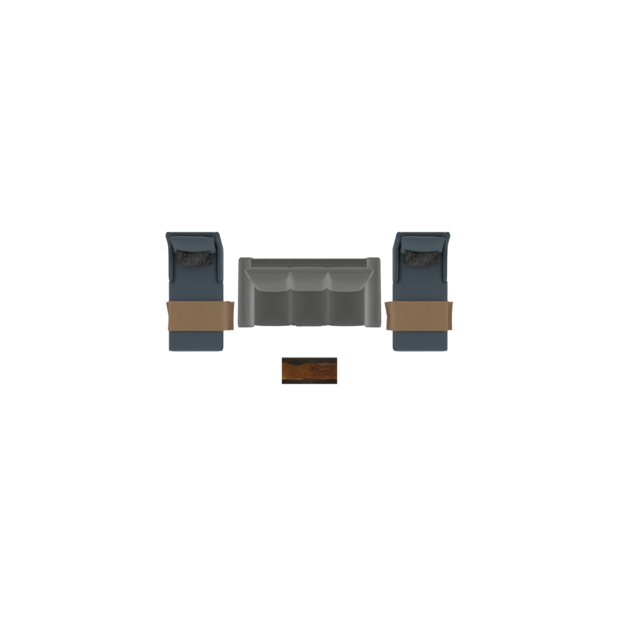
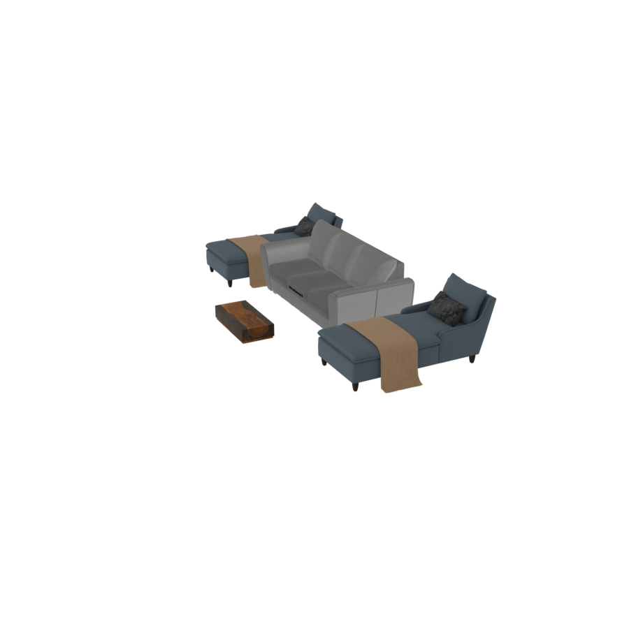
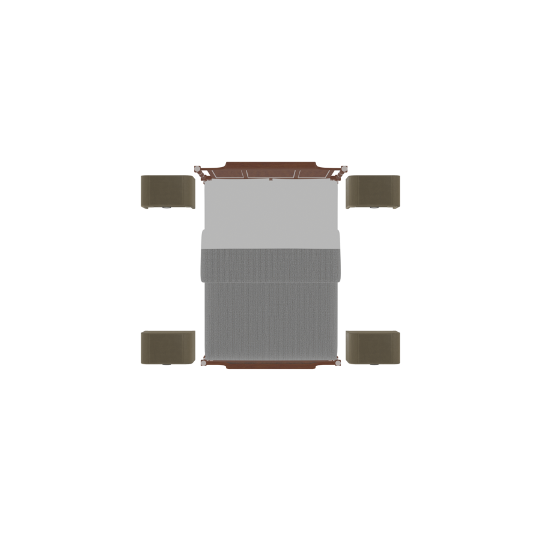
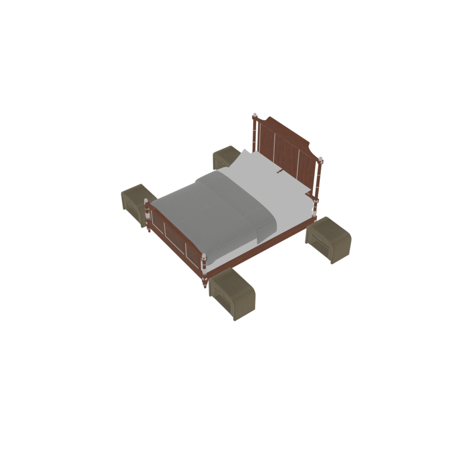
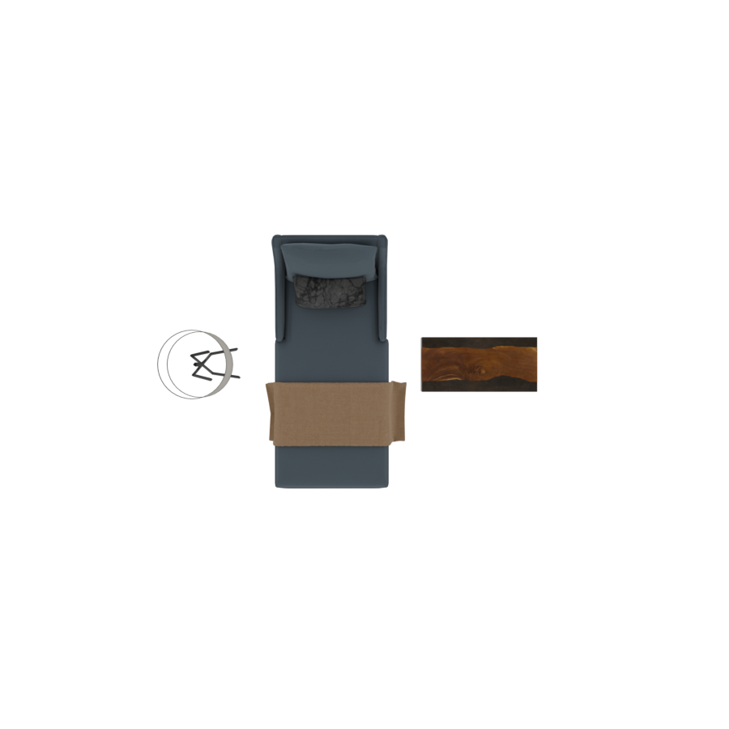
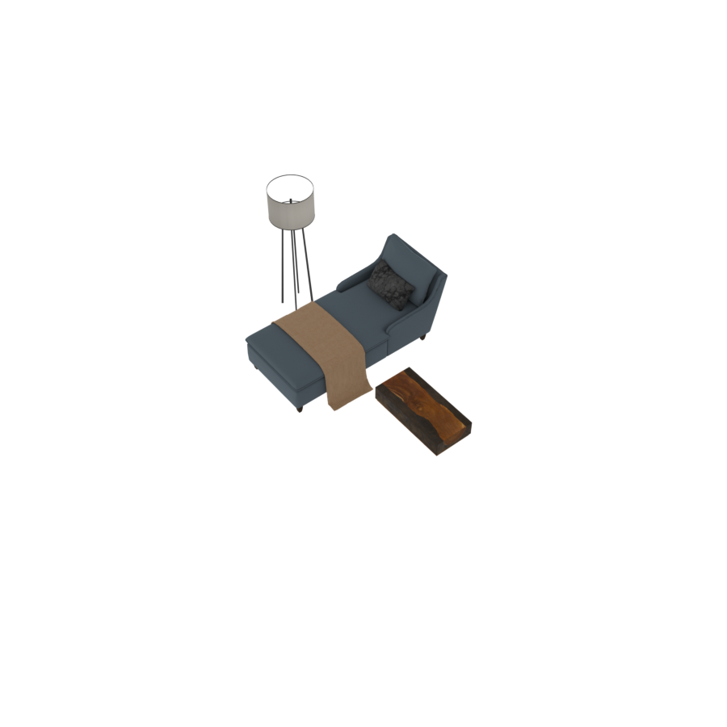
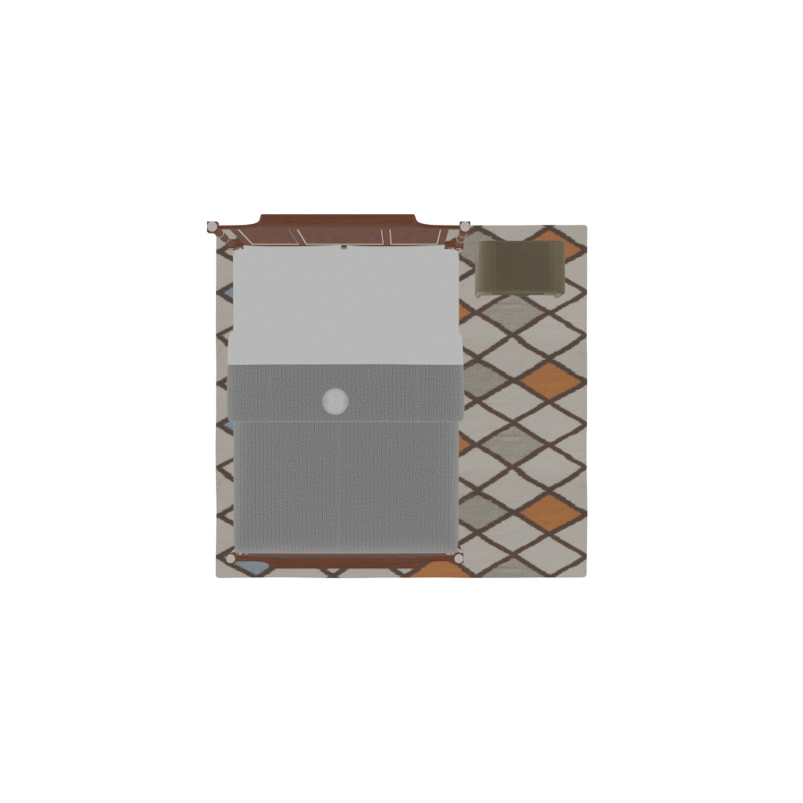
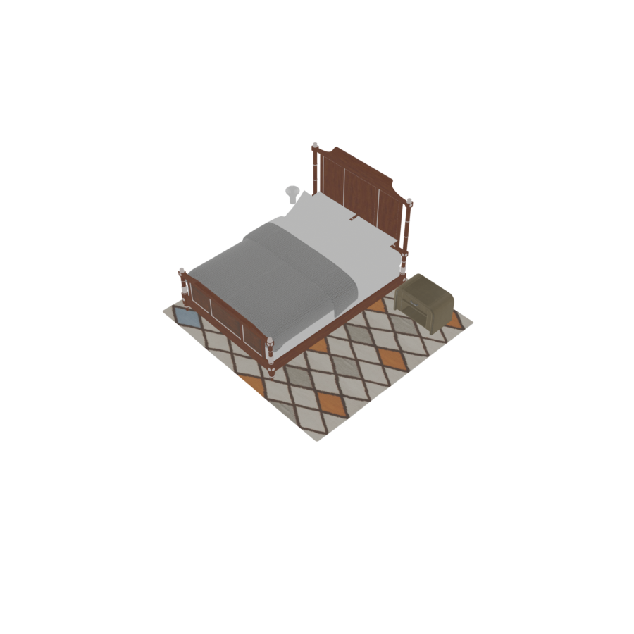

# RelativeGroup

A `RelativeGroup` places objects **relative to an anchor**. You pick one object as the
anchor with `set_anchor`, then describe where the others go in human terms — *in front of*,
*to the left of*, *behind*, *on top of*. This is the workhorse for furniture clusters: a bed
with nightstands, a sofa with a coffee table and side chairs, a desk with a chair.

```python
with scene.RelativeGroup() as seating:
    sofa    = scene.AddAsset("a modern 3-seat sofa")
    table   = scene.AddAsset("a rectangular wooden coffee table")
    chair_l = scene.AddAsset("a cozy lounge chair")
    chair_r = scene.AddAsset("a cozy lounge chair")
    seating.set_anchor(sofa)
    seating.place_on_front(table)
    seating.place_on_left(chair_l)
    seating.place_on_right(chair_r)
```

<p style="text-align: center;">
  
  
</p>

The anchor (sofa) defines the local frame: **front is +Z**, **back is −Z**, **left and
right** are along X. Every placement is measured from the anchor's edges, so the layout
adapts automatically to the anchor's size.

## Placement rings

`RelativeGroup` placements fall into three concentric "rings" around the anchor.

### Adjacent ring — touching the anchor

These place an object flush against the anchor with only a small buffer gap. Best for things
that physically attach to the anchor, like a chair tucked under a desk.

| Method | Position |
|---|---|
| `place_on_front_adjacent(obj)` | directly in front of the anchor, flush against it |
| `place_on_back_adjacent(obj)` | directly behind the anchor, flush against it |

### Near ring — beside the anchor

The default ring. Objects sit just off the anchor's edge with a standard side gap.

| Method | Position |
|---|---|
| `place_on_front(obj)` | in front of the anchor |
| `place_on_back(obj)` | behind the anchor |
| `place_on_left(obj)` | to the left |
| `place_on_right(obj)` | to the right |
| `place_on_front_left(obj)` | front-left corner |
| `place_on_front_right(obj)` | front-right corner |
| `place_on_back_left(obj)` | back-left corner |
| `place_on_back_right(obj)` | back-right corner |

The four corner placements occupy the four distinct quadrants around the anchor — ideal for
symmetric arrangements like nightstands at the corners of a bed:

```python
with scene.RelativeGroup() as bedside:
    bed = scene.AddAsset("a queen-sized bed with a wooden frame")
    bedside.set_anchor(bed)
    bedside.place_on_back_left(scene.AddAsset("a small wooden nightstand with a drawer"))
    bedside.place_on_back_right(scene.AddAsset("a small wooden nightstand with a drawer"))
    bedside.place_on_front_left(scene.AddAsset("a small wooden nightstand with a drawer"))
    bedside.place_on_front_right(scene.AddAsset("a small wooden nightstand with a drawer"))
```

<p style="text-align: center;">
  
  
</p>

### Further ring — at circulation distance

The `_further` variants place objects beyond the near ring, at a *circulation distance* that
leaves walking space. They account for everything already in the near ring, so a `_further`
object always clears the inner objects — useful for a floor lamp beside an armchair, or a
console table behind a sofa with a walkway between.

| Method | Position |
|---|---|
| `place_on_front_further(obj)` / `place_on_back_further(obj)` | front / back, past the near ring |
| `place_on_left_further(obj)` / `place_on_right_further(obj)` | left / right, past the near ring |
| `place_on_front_left_further(obj)` … `place_on_back_right_further(obj)` | the four corners, past the near ring |

```python
with scene.RelativeGroup() as g:
    table = scene.AddAsset("a rectangular wooden coffee table")
    g.set_anchor(table)
    g.place_on_left(scene.AddAsset("a cozy lounge chair"))          # near ring
    g.place_on_left_further(scene.AddAsset("a tall floor lamp"))    # further ring
```

<p style="text-align: center;">
  
  
</p>

The lamp (further) sits beyond the lounge chair (near) even though both are placed on the
left — the further ring measured the chair's extent and stepped around it.

## Stacking and rugs

### `place_on_top(objs)`

Places one or more objects on the **top surface** of the anchor, distributed evenly across
it (a lamp on a nightstand, books on a table). Objects placed on top are marked
`ignore_overlap` so optimization won't slide them off. This placement is *delayed* — it runs
after the rest of the group is laid out, so it always lands on the anchor's final position.

### `place_rug(desc, size)`

Retrieves a rug and lays it under the group, sized to the group's footprint.

| Parameter | Type | Description |
|---|---|---|
| `desc` | `str` | Natural-language description of the rug to retrieve. |
| `size` | `float` in `[0, 1]` | How much of the group's footprint the rug covers. Larger values produce a rug that extends further past the furniture. |

```python
with scene.RelativeGroup() as bed_area:
    bed = scene.AddAsset("a queen-sized bed with a wooden frame")
    bed_area.set_anchor(bed)
    bed_area.place_on_back_right(scene.AddAsset("a small wooden nightstand with a drawer"))
    bed_area.place_on_top(scene.AddAsset("a modern table lamp with a white shade"))
    bed_area.place_rug("a soft neutral area rug", size=0.9)
```

<p style="text-align: center;">
  
  
</p>

## Compilation

When the `with` block closes, the `RelativeGroup`:

1. executes placements in ring order (near → further → top),
2. compiles any child groups first,
3. runs an `OverlapConstraint` plus a VLM `ObjectProportionsConstraint` to catch mismatched
   object sizes,
4. freezes into a single unit whose bounding box spans all its members.

Because the compiled group is a single unit, you can nest it: place a `RelativeGroup` inside
another group, or hand it to a `RoomGroup`. See [Hierarchical Layout](hierarchical).
