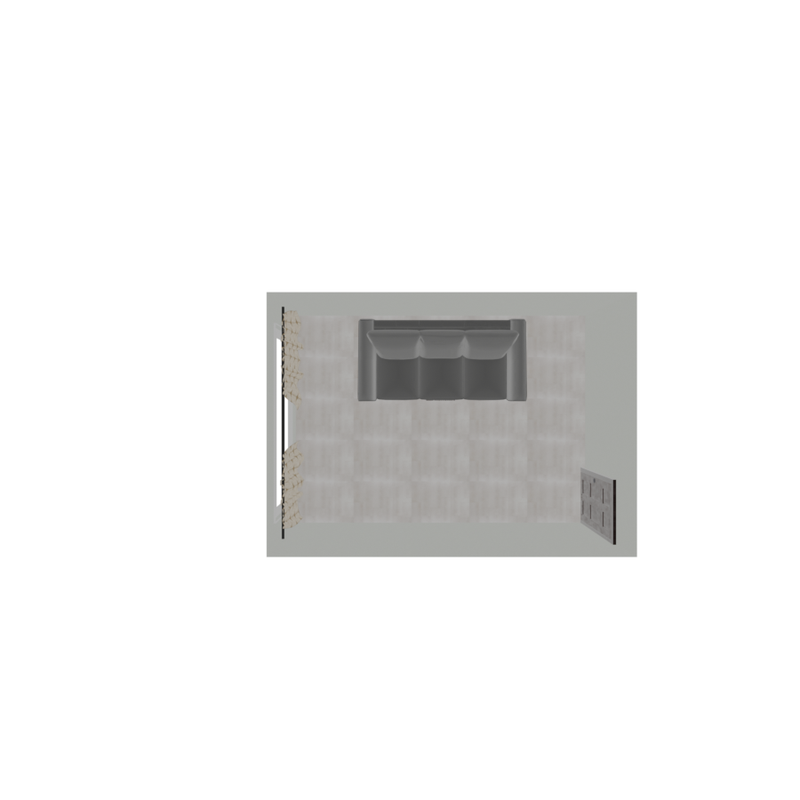
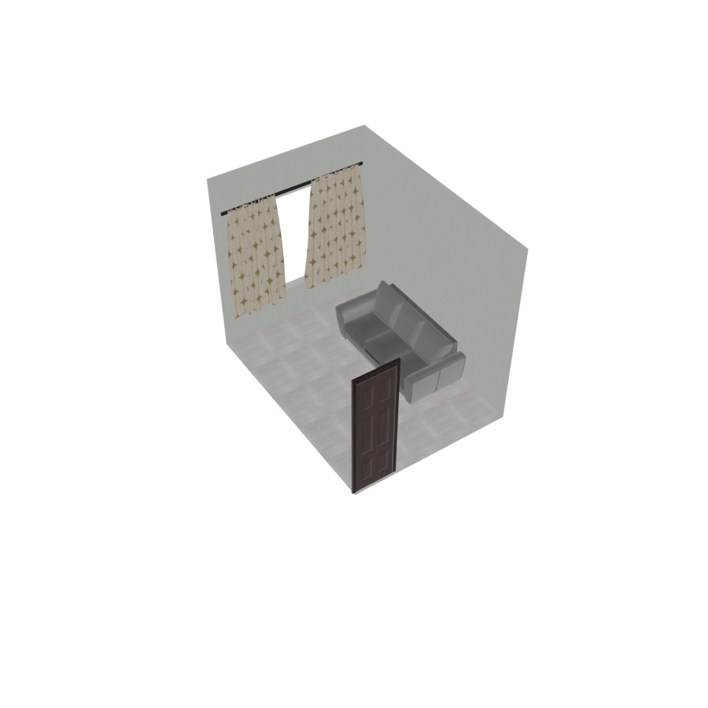
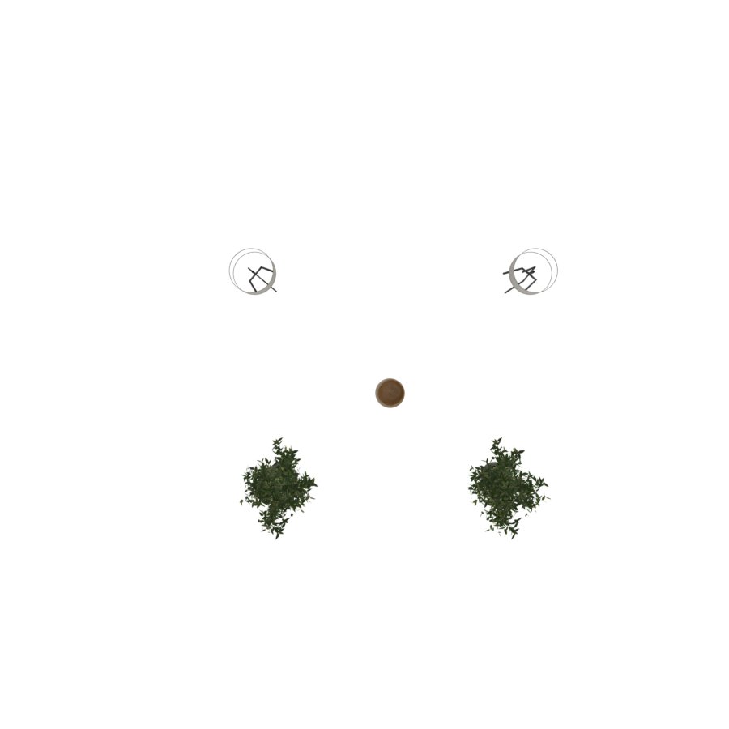
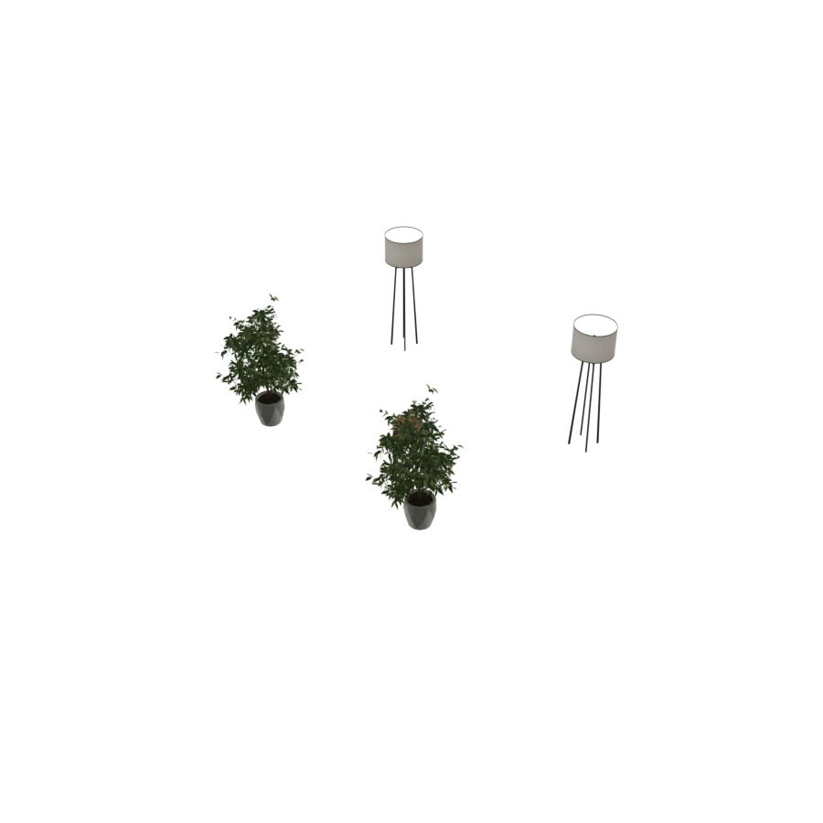
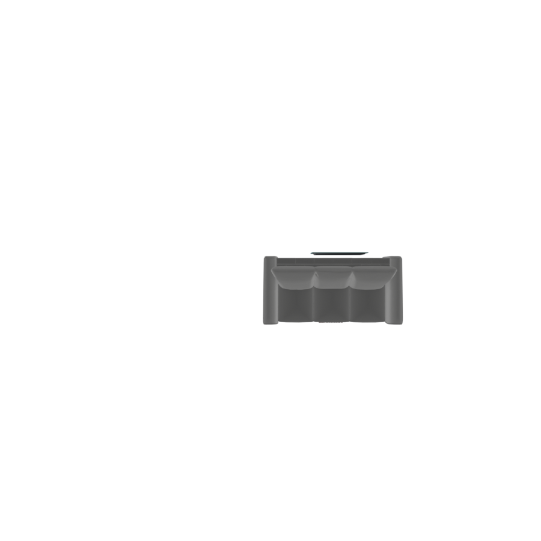
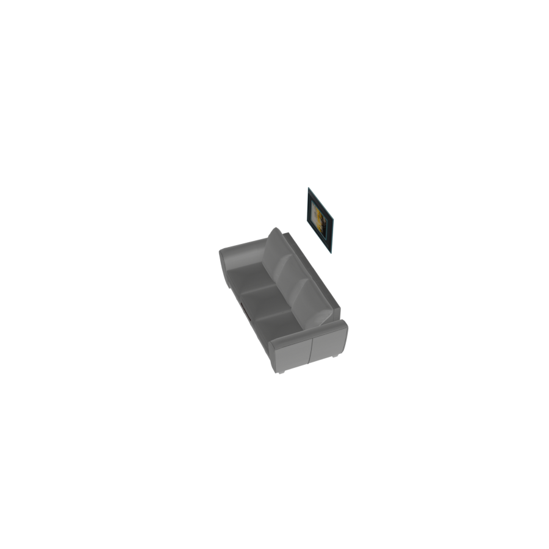

# RoomGroup

The `RoomGroup` is the **top-level container** for a scene. It does three things the other
groups don't:

1. **Infers a room size** large enough to hold everything you place in it.
2. Exposes a **grid of named positions** (center, walls, corners) for furniture.
3. Builds the **architecture** — walls, floor, ceiling, doors, and windows — and mounts
   objects on the walls.

```python
with scene.RoomGroup() as room:
    room.place_on_back_wall_center(sofa, facing="front")
    room.place_walls(
        floor_texture="light oak wood floor",
        ceiling_texture="smooth white ceiling",
        wall_texture="warm off-white painted wall",
    )
```

<p style="text-align: center;">
  
  
</p>

## Automatic room sizing

You never specify room dimensions directly (unless you use `BasicRoomGroup`). The
`RoomGroup` measures everything you place in it and computes a `WIDTH`, `DEPTH`, and `HEIGHT`
that fit. The optional **`modulate_scale`** parameter scales the inferred room up or down:

```python
with scene.RoomGroup(modulate_scale=1.5) as room:   # 50% more breathing room
    ...
```

| Parameter | Type | Default | Description |
|---|---|---|---|
| `modulate_scale` | `float` | `1.0` | Multiplier on the inferred room size. `>1` adds space; `<1` tightens. |

After compilation the room's dimensions are available as `room.WIDTH`, `room.DEPTH`,
`room.HEIGHT`.

## Floor positions

These place an object (or a whole group) on the floor at a named position. Each accepts an
optional **`facing`** argument (`"front"`, `"back"`, `"left"`, `"right"`); if omitted, a
sensible orientation is inferred from the position.

| Region | Methods |
|---|---|
| Center | `place_on_center` |
| Mid-edges | `place_on_back`, `place_on_front`, `place_on_left`, `place_on_right` |
| Quadrants | `place_on_back_left`, `place_on_back_right`, `place_on_front_left`, `place_on_front_right` |
| Corners | `place_on_back_left_corner`, `place_on_back_right_corner`, `place_on_front_left_corner`, `place_on_front_right_corner` |

<p style="text-align: center;">
  
  
</p>

The image above places a coffee table at the center and lamps/plants in the four corners.

## Against-the-wall positions

These push furniture flush against a wall, in one of three slots per wall (left / center /
right). The object is turned to face into the room.

| Wall | Methods |
|---|---|
| Back | `place_on_back_wall_left`, `place_on_back_wall_center`, `place_on_back_wall_right` |
| Front | `place_on_front_wall_left`, `place_on_front_wall_center`, `place_on_front_wall_right` |
| Left | `place_on_left_wall_left`, `place_on_left_wall_center`, `place_on_left_wall_right` |
| Right | `place_on_right_wall_left`, `place_on_right_wall_center`, `place_on_right_wall_right` |

## Wall-mounted objects

Objects hung **on** a wall (paintings, mirrors, TVs) rather than standing on the floor. They
are scaled to a sensible size for the wall and marked `ignore_overlap`.

| Method | Behavior |
|---|---|
| `place_on_wall_<wall>_<slot>(obj)` | Hang `obj` on the given wall/slot (e.g. `place_on_wall_back_center`). If furniture stands in that slot, the art is hung **above** it; otherwise it is centered at mid-wall height. |
| `place_on_wall_freeform(wall, objs)` | Spread several objects evenly across a wall (a gallery wall). |

```python
with scene.RoomGroup() as room:
    room.place_on_back_wall_center(sofa, facing="front")
    room.place_on_wall_back_center(painting)   # hung above the sofa
```

<p style="text-align: center;">
  
  
</p>

## Architecture: walls, doors, windows

### `place_walls(floor_texture, ceiling_texture, wall_texture)`

Builds the four walls, the floor, and the ceiling, each textured from a natural-language
description.

| Parameter | Description |
|---|---|
| `floor_texture` | Description of the floor material (e.g. `"light oak wood floor"`). |
| `ceiling_texture` | Description of the ceiling material. |
| `wall_texture` | Description of the wall material. |

### `place_door(wall, position)`

Cuts a door into a wall.

| Parameter | Description |
|---|---|
| `wall` | `"back_wall"`, `"front_wall"`, `"left_wall"`, or `"right_wall"`. |
| `position` | `"left"`, `"center"`, or `"right"` slot on that wall. |

### Windows

Three window styles, each cut into a wall and optionally fitted with a curtain (`curtain` is
a texture description).

| Method | Description |
|---|---|
| `place_window_picture(wall, curtain=None)` | A wide, fixed picture window. |
| `place_window_floor_to_ceiling(wall, curtain=None)` | A full-height window spanning the wall. |
| `place_window_standard(wall, position, curtain=None)` | A standard window in the `left`/`center`/`right` slot. |

```python
room.place_walls(floor_texture="light oak wood floor",
                 ceiling_texture="smooth white ceiling",
                 wall_texture="warm off-white painted wall")
room.place_door("right_wall", position="right")
room.place_window_picture("left_wall")
```

## Compilation order

`RoomGroup` compilation is more involved than the other groups, because architecture must be
resolved after furniture:

1. Floor and against-wall furniture are placed, and the room size is inferred.
2. Child groups compile (each frozen group is treated as one rigid unit).
3. `OverlapConstraint` and `OutOfBoundsConstraint` run, then the gradient solver nudges
   everything into a non-overlapping, in-bounds layout.
4. Wall-mounted objects, doors, and windows are placed (they depend on final furniture
   positions).
5. VLM checks (`RoomProportionsConstraint`, `WallOverlapConstraint`) run.

See [Hierarchical Layout & Parent–Child Relationships](hierarchical) for how nested groups
behave during step 2–3.

## `BasicRoomGroup` — explicit dimensions

When you want exact control instead of inferred sizing, `BasicRoomGroup` takes explicit
`WIDTH`, `DEPTH`, `HEIGHT` and a `place(objs, positions, rotations)` method for direct
coordinate placement. It still runs overlap and out-of-bounds optimization, which makes it
the simplest way to see those constraints in isolation.

```python
with BasicRoomGroup(scene, WIDTH=6.0, DEPTH=5.0, HEIGHT=3.0) as room:
    room.place([sofa, table, chair],
               positions=[(1.5, 0, 2.5), (2.5, 0, 2.5), (4.0, 0, 2.5)],
               rotations=[0, 0, 0])
```
