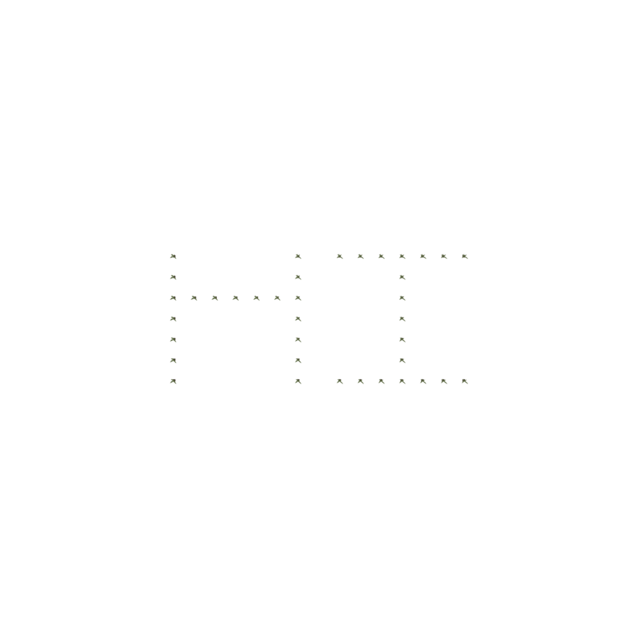
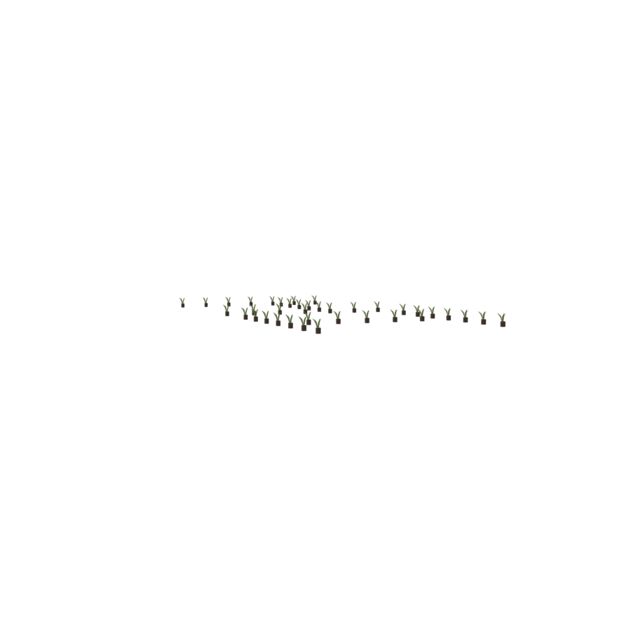

# SentenceASCIIGenerator

`SentenceASCIIGenerator` is a specialty group that lays out copies of a single object in the
shape of **text**. Give it one asset and a string, and it stamps a copy of the asset at each
filled cell of an ASCII-art rendering of that string — useful for signage, event displays, or
playful arrangements (a hedge spelling a word, tea-lights forming a message).

```python
with scene.SentenceASCIIGenerator() as ascii_gen:
    plant = scene.AddAsset("a small succulent plant")
    ascii_gen.place(plant, "HI")
```

<p style="text-align: center;">
  
  
</p>

## `place(obj, sentence)`

| Parameter | Type | Description |
|---|---|---|
| `obj` | object | The asset to stamp at each filled cell. It is copied automatically — you pass one object, not a list. |
| `sentence` | `str` | The text to render. Use `\t` to separate words on a line and `\n` to start a new line. |

The generator computes how many cells the text occupies, copies the object that many times,
and positions one copy per cell on the floor plane.

```python
ascii_gen.place(plant, "WORLD\tPEACE\n2045")
```

## How it works

Behind the scenes the generator uses a language model to produce an ASCII-art bitmap for each
character (an `AlphabetGenerator`/`WordGenerator` pair), then maps every `*` cell of that
bitmap to a copy of your object. Because it calls a language model to render glyphs, it is
slower than the purely geometric groups and requires a configured model.

## Compilation

Like the other groups, `SentenceASCIIGenerator` is used as a context manager and freezes into
a single unit when the block closes. Its layout is deterministic given the glyph bitmaps, so
compilation simply executes the placements — there is no overlap or proportion optimization.
The frozen result can be placed in a room or another group like any other unit:

```python
with scene.RoomGroup() as room:
    room.place_on_center(ascii_gen, facing="front")
```
